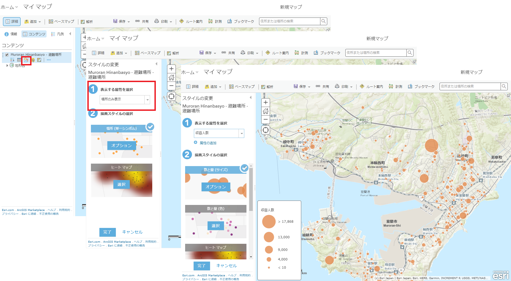
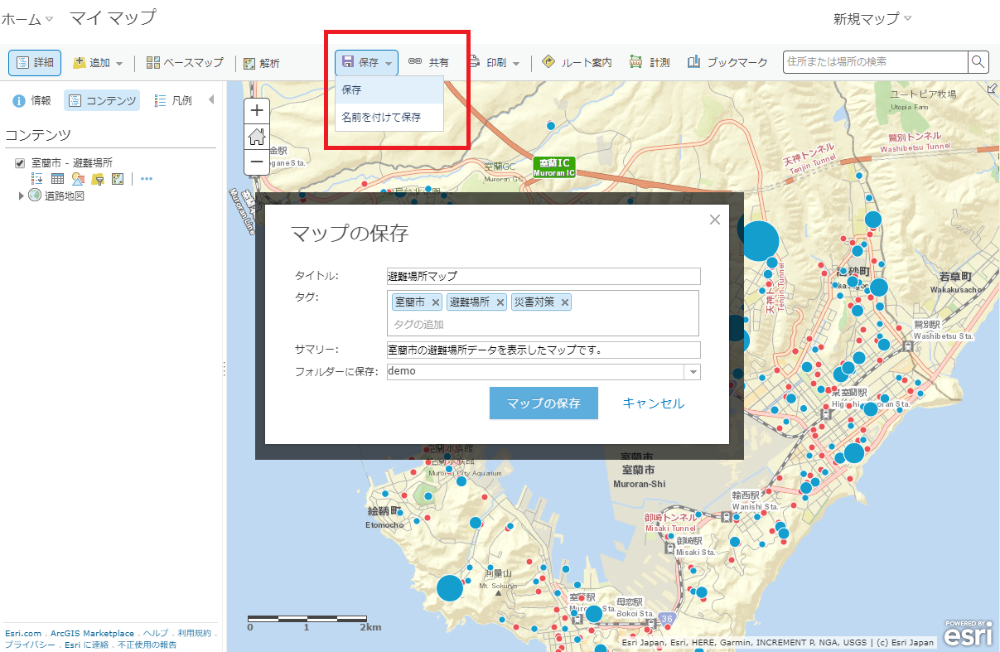
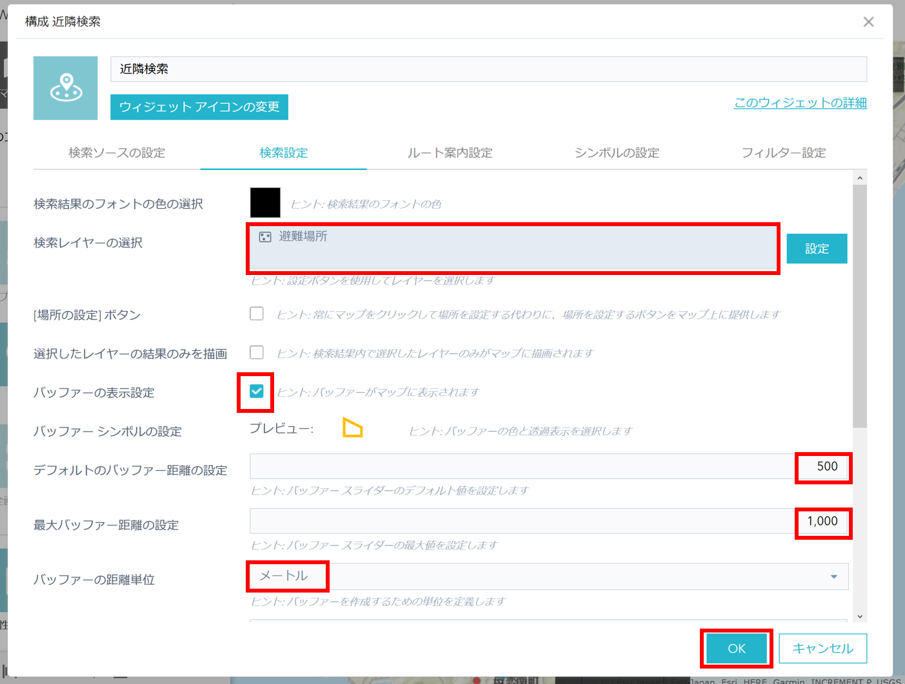

# 実践 ArcGIS で可視化してみよう

## 概要

この手順書では、避難場所を可視化した Web マップの作成、および作成した Web マップから Web AppBuilder for ArcGIS を使用して Web アプリケーションを作成する方法をご紹介しています。 

## 1. Web マップの作成

ArcGIS Online へサインインし、[Web マップ](https://www.esrij.com/gis-guide/web-gis/web-map/)を作成します。

### 1. ArcGIS Online へアクセス

[ArcGIS Online](https://www.arcgis.com/home/)へアクセスし、ArcGIS for Developers のユーザー名とパスワードを入力してサイン インします。  
[マップ] をクリックして、マップビューアーを開きます。

### 2. Web マップの作成

マップビューアーを使用して、アプリケーションで利用する Web マップを構築します。

#### データの入手

Web マップで使用するデータを入手します。
今回は、室蘭市がオープンデータとして公開している避難場所データを使用します。  
[ESRIジャパン オープンデータポータル](http://data.esrij.com/) へアクセスし、[避難場所データ](http://data.esrij.com/datasets/muroran::避難場所)を検索します。  

避難場所データは、ArcGIS Online にホストされているため、独自にサービスを公開する必要はありません。  
ジオサービスの URLをコピーします。

#### データの追加

Web マップに、避難場所データを表示します。  
マップビューアーを開き、[追加] をクリックします。[Web からレイヤーを追加] を選択し、コピーしたサービスの URL を入力し、入力した URL の 「query?outFields=*&where=1%3D1」 の部分を削除します。  
Web マップに避難場所データがレイヤーとして追加されました。

#### スタイルの変更

追加した避難場所データのスタイルを変更します。  
マップビューアーにはスマートマッピングと呼ばれる、マップ上で表現したい属性を指定するだけで、シンボルの大きさや、色、表示縮尺、分類の閾値などが自動で設定され、その属性の内容（文字列、実数、整数等）に応じて適した表現方法を提示する機能が提供されています。

[コンテンツ] の避難場所データの [スタイルの変更]をクリックします。レイヤー名にカーソルを合わせると、レイヤー名の下にメニューが表示されます。[表示する属性を選択] から「収容人数」を選択します。収容人数に含まれる値をもとに最適な表現方法が自動で設定されます。  
また、必要に応じて、[オプション] から、色やサイズ、閾値、クラス分け、透過率などを手動で設定することも可能です。

スマートマッピングでは、色と大きさを使用して、複数のスタイルを設定することもできます。

「収容人数」に加えて、「屋内屋外」も表現してみましょう。
[①表示する属性を選択] の、[属性の追加] をクリックし、「屋内屋外」を選択、[完了]をクリックします。すると、避難所が屋内にあるのか、屋外にあるのかが色で表現され、収容人数が円の大きさで表現されます。

マップビューアーには、データを追加したりスタイルを変更するほかに、ポップアップの構成やフィルタリングなどの様々な機能が提供されており、簡単に Web マップを構成することができます。

#### ポップアップの構成

フィーチャをクリックすると、フィーチャの属性情報がポップアップに表示されます。ポップアップの内容を変更してみましょう。
[コンテンツ] のレイヤー名にカーソルを合わせ、[…] をクリック、「ポップアップの構成」を選択します。
ポップアップのタイトルを「避難場所」に変更します。
[属性フィールドの構成] をクリックし、以下の属性フィールドにチェックを入れて [OK] をクリックします。

* 施設名称
* 住所
* 施設分類
* 屋内屋外
* 広域一時
* 津波避難
* 建築年
* 構造
* 収容人数

#### ベースマップの変更

ベースマップも変更してみましょう。メニューバーの [ベースマップ] をクリックし、[道路地図] を選択します。

#### マップの保存

作成した Web マップを保存します。  
[保存] をクリックして [保存] を選択します。任意のタイトル、タグ、サマリー、保存先のフォルダーを選択し [マップの保存] をクリックします。

Web マップを保存すると Web マップ ID とよばれる一意の ID が作成されます。Web マップ ID は URL から確認できます。  
Web マップ ID は、アプリケーションから Web マップを参照する際に使用するため、控えておきましょう。

## 2. アプリケーションの作成

作成した Web マップをアプリケーションに読み込み、避難場所を検索する機能を持つアプリケーションを作成します。

### 1. Web AppBuilder の起動

ノーコーディングで WebGIS アプリケーションを作成することができる [Web AppBuilder for ArcGIS](https://doc.arcgis.com/ja/web-appbuilder/) （以下 Web AppBuilder）を使用します。
[共有] をクリックして、[Web アプリケーションの作成] をクリック、[Web AppBuilder] タブを選択し、[開始] をクリックすると Web AppBuilder が起動します。

画面左側がアプリケーションを編集するパネル、右側が作成したアプリケーションのプレビュー画面です。変更を加えるとすぐにプレビュー画面にも反映されます。

### 2. テーマの変更

[テーマ] タブをクリックします。[テーマ] タブではアプリケーションのデザインを変更することができます。今回は「ローンチパッド テーマ」を使用し、色を黒に変更します。

### 3. ウィジェットの追加

[ウィジェット] タブをクリックします。Web AppBuilder では、ウィジェットを追加することでアプリケーションの機能を実装します。デフォルトで 40 個以上のウィジェットが用意されています。
左側のパネル下部にある灰色のボックスをクリックすると、「ウィジェットの選択」画面が表示されます。
今回は、[近隣検索ウィジェット](https://doc.arcgis.com/ja/web-appbuilder/create-apps/widget-near-me.htm) を追加します。近隣検索ウィジェットを使用すると、指定した住所、または場所から一定の距離内にあるフィーチャを検索したり、選択したフィーチャまでのルート案内を取得したりすることができます。

ウィジェットの構成画面で、ウィジェットの機能を設定します。
[検索設定] タブをクリックし、下記の通り設定します。
* 「検索レイヤーの選択」で室蘭市避難場所レイヤーを選択
* 「バッファーの表示設定」オプションのチェックボックスをオン
* 「デフォルトのバッファー距離の設定」を「500」に変更
* 「最大バッファー距離の設定」を「1000」に変更
* 「バッファーの距離単位」を「メートル」に変更

### 4. 属性の変更

[属性] タブをクリックします。[属性] タブでは、アプリケーションのロゴ、タイトル、サブタイトルなどを変更することができます。
タイトルを「室蘭市避難場所検索アプリ」に変更します。

以上でアプリケーションの作成は完了です。

### 5. アプリケーションの起動

左下の [保存] をクリックし、アプリケーションを保存します。保存が完了した後、[起動] をクリックするとアプリケーションが起動します。

追加した近隣検索ウィジェットのアイコンをクリックし、近隣検索ウィジェットを起動してみましょう。住所を入力するか、マップ上をクリックして場所を指定します。指定した位置から半径500 メートルの範囲内にある避難場所が表示されます。

## 関連リンク

本手順書では、初歩的な操作方法についてご紹介しました。さらに、もっと高度な可視化に挑戦してみたい方は、開発リソース集の[ArcGIS Online 上のデータを可視化するための方法](http://esrijapan.github.io/arcgis-dev-resources/tips/data-visualization-procedure/) をご参照ください。
