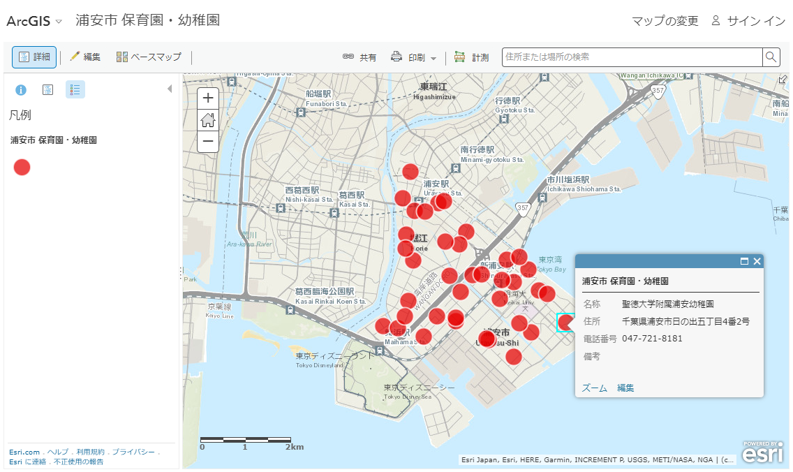
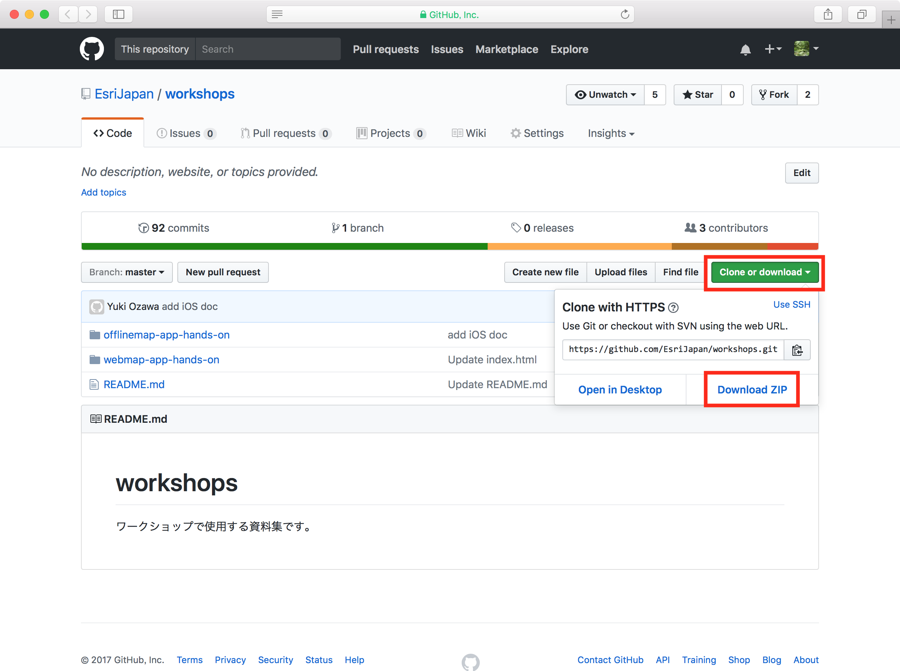
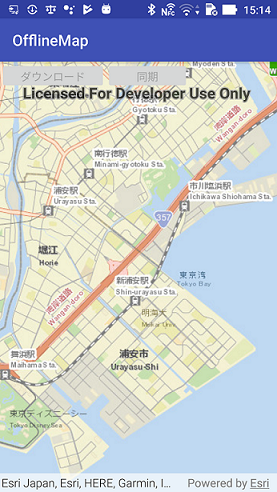
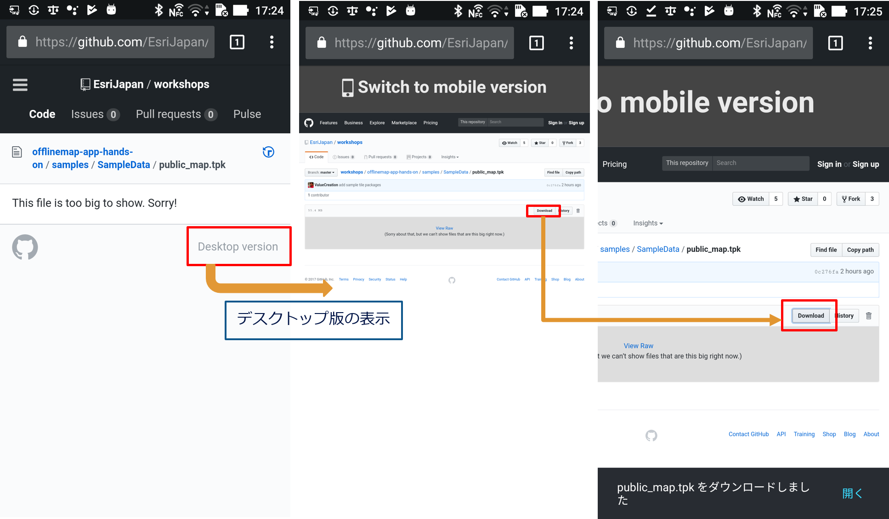
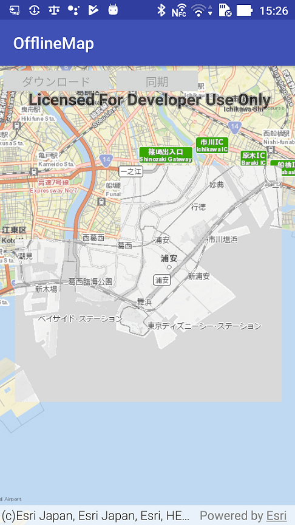
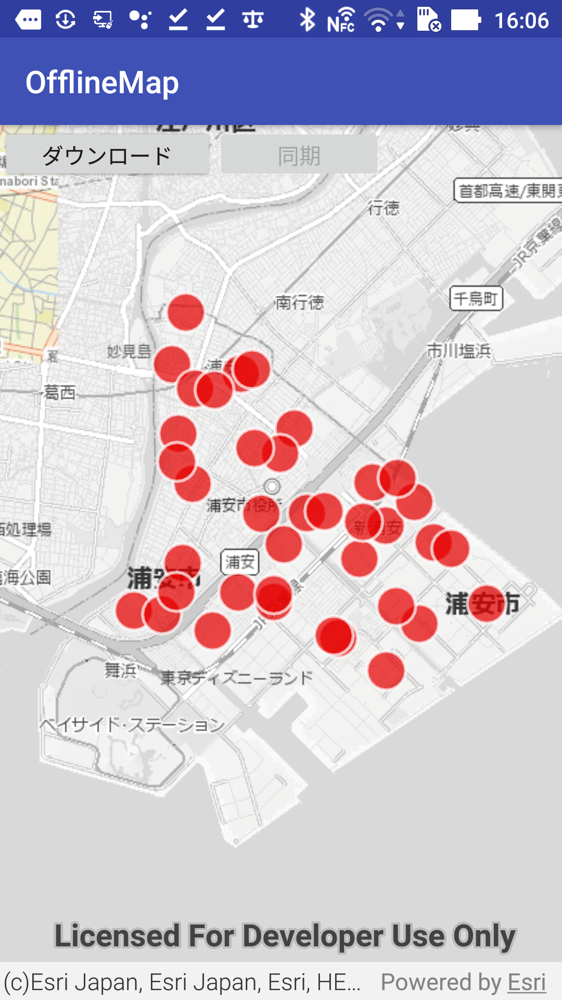
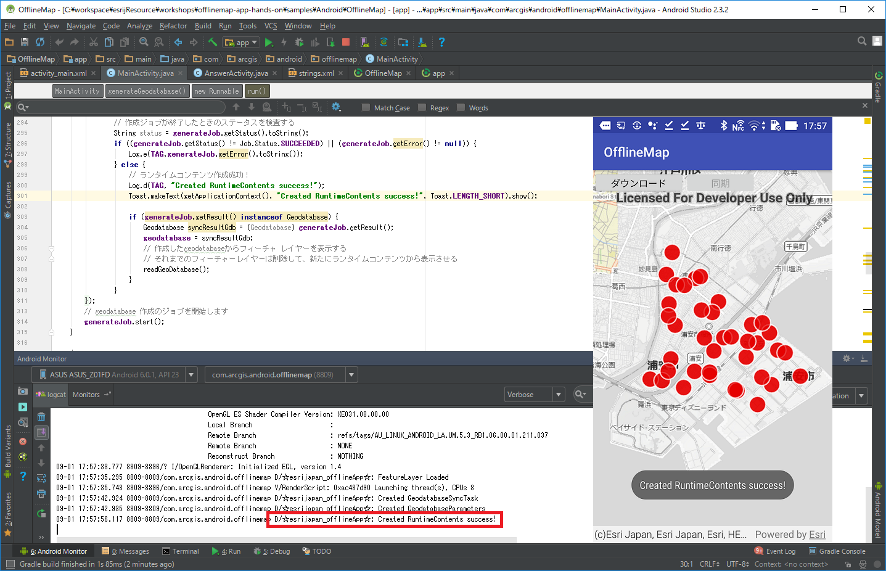
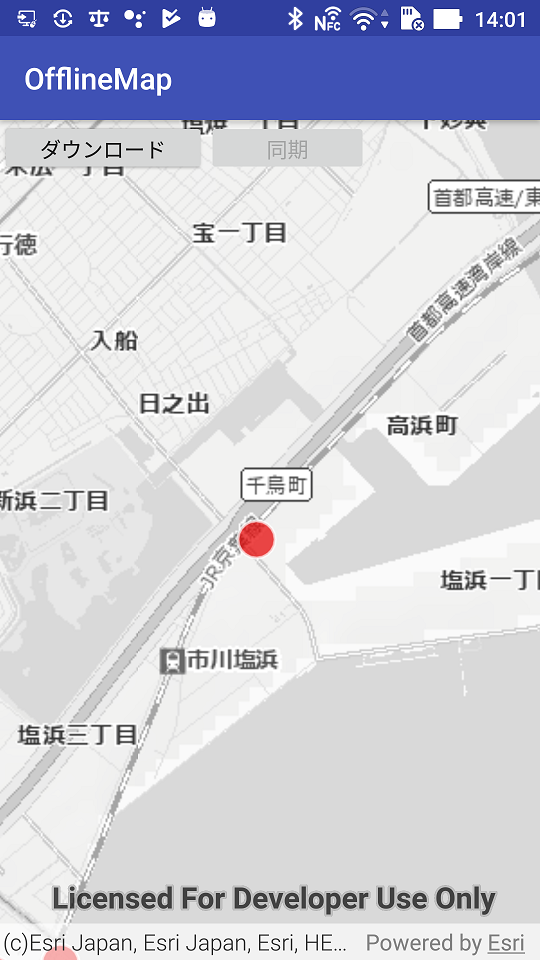
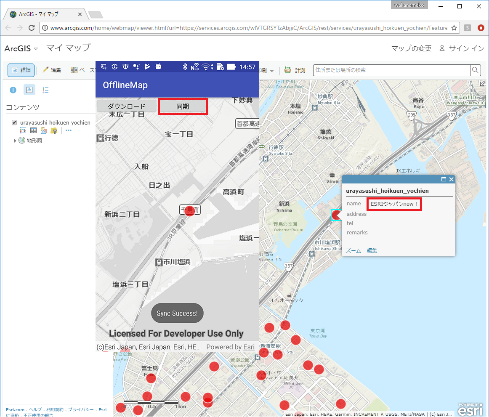

# オフライン アプリ開発ハンズオン

[ArcGIS Runtime SDK for Android](https://developers.arcgis.com/android/latest/) を使用してオフライン アプリを作成するハンズオンです。

## 実装する機能
- タイル パッケージ（背景地図）の表示
- フィーチャ サービス（主題図）の表示
- フィーチャ サービスのデータのダウンロード
- フィーチャの編集（ポイント追加）
- 編集結果をフィーチャ サービスと同期

## 開発環境
使用する環境が動作要件を満たしているか[こちら](https://www.esrij.com/products/arcgis-runtime-sdk-for-android/environments/)のページからご確認ください。

## 使用するデータ
- 背景地図：[タイル パッケージ](https://desktop.arcgis.com/ja/arcmap/latest/map/working-with-arcmap/about-tile-packages.htm)（ArcGIS Desktop で作成）
 * ESRIジャパン データコンテンツのスターターパックに含まれる[公共地図](https://www.esrij.com/products/data-content-starter/details/kokyo/)を使用
- 主題図：[フィーチャ サービス](http://doc.arcgis.com/ja/arcgis-online/share-maps/publish-features.htm)（ArcGIS Online で配信）
 * デモ用の保育園・幼稚園データ（浦安市の保育園・幼稚園のオープンデータをもとに作成）
 * フィーチャ サービスの URL（Rest エンドポイント）: https://services.arcgis.com/wlVTGRSYTzAbjjiC/ArcGIS/rest/services/urayasushi_hoikuen_yochien/FeatureServer
 * ArcGIS .com マップ ビューアーで[データを確認してみる](https://www.arcgis.com/home/webmap/viewer.html?webmap=49aaf6580c9142e28d8912cee6f573c9)



## 手順 1: プロジェクトのダウンロード
### サンプル プロジェクトのダウンロード
1. [workshops](https://github.com/EsriJapan/workshops) ページを開いて [Clone or download] -> [Download ZIP] をクリックして、ファイル一式をダウンロードします。</br>
1. サンプル プロジェクト（workshops/offlinemap-app-hands-on/samples/Android/offlineMap）を Android Studio で開きます。
1. Android Studio によるプロジェクト ビルドが終了したら、エミュレータまたは実機をつなげてアプリを実行してみましょう。次のような画面が表示されます。<br>

#### Tips:
* SDK は Gradle へ参照先を明記して使用しますが、SDKの[ダウンロードページ](https://developers.arcgis.com/downloads)から jar ファイルをダウンロードして使用することも可能です。その場合はプロジェクト直下にlibフォルダを作成し、Gradle ファイルに以下のように定義します。なお、jarファイルをダウンロードする場合は開発者アカウントが必要になります。作成する場合は、[こちら](http://esrijapan.github.io/arcgis-dev-resources/get-dev-account/)を参考にして作成してください）。
* サンプル プロジェクトには事前に必要な マニュフェストやレイアウトの設定、ボタン等を作成しています。アプリ開発時に必要な設定は[インストール ガイド](http://esrijapan.github.io/arcgis-dev-resources/android/install-android-100.x/)をご覧ください。
* 今回のハンズオンで作成するサンプルの完成版が[こちら](https://github.com/wakanasato/workshops/blob/master/offlinemap-app-hands-on/samples/Android/OfflineMap/app/src/main/java/com/arcgis/android/offlinemap/AnswerActivity.java)にありますので、作業に困ったら参考にしてください。

## 手順 2: タイル パッケージ（背景地図）の表示
1. ハンズオンで使用するタイル パッケージ（背景地図）を実行する端末またはエミューレーターへダウンロードします。タイル パッケージ (orkshops/offlinemap-app-hands-on/samples/SampleData/public_map.tpk) へ実機またはエミュレーターからアクセスして、ダウンロードします。ダウンロードしたファイルは、ファイルマネージャー アプリなどを使用して内部ストレージである sdcard/Downloads 配下に格納されることを確認します。実機の場合URLは [http://bit.ly/2ex6vIj](http://bit.ly/2ex6vIj) をご利用ください。なおこのタイル パッケージの公開は当日のみの利用としています。</br>

  * adb コマンドを使用する場合は、タイル パッケージを任意の場所にダウンロードしたあと、次のコマンドを実行します。</br>>adb push public_map.tpk /sdcard/Download/

1. タイル パッケージ（背景地図）を表示するコードを記述します。`readTilePkg()` メソッドを次のように実装します。TileCache のパラメーターにはタイル パッケージ ファイルのファイル名（.tpk のファイル名）を指定します。
```java
String tpkpath  = mLocalFilePath + getResources().getString(R.string.tpk_name);
// 存在チェック
File tpkfile = new File(mLocalFilePath);
if(!tpkfile.exists()){
    Log.d(TAG, tpkpath + ":" + tpkfile.exists());
}else{
    // tpkファイルはレイヤーとして表示する
    TileCache tileCache = new TileCache(tpkpath);
    ArcGISTiledLayer tiledLayer = new ArcGISTiledLayer(tileCache);
    mArcGISmap.getOperationalLayers().add(tiledLayer);
}
```
1. サンプル プロジェクトを実機もしくはシミュレーターで実行すると、以下のように地図が表示されます。</br>

## 手順 3: フィーチャ サービス（主題図）の表示

1. フィーチャ レイヤーを作成しフィーチャ サービス（主題図）をマップに追加します。`readFeatureLayer()` メソッドを次のように実装します。
 ```java
 // フィーチャ サービスの URL を指定してフィーチャ テーブル（ServiceFeatureTable）を作成する
 // フィーチャ サービスの URL はレイヤー番号（〜/FeatureServer/0）まで含める
 String FeatureServiceURL = mArcGISFeatureServiceUrl + "/0";
 FeatureTable featureTable = new ServiceFeatureTable(FeatureServiceURL);
 // フィーチャ テーブルからフィーチャ レイヤーを作成
 final FeatureLayer featureLayer = new FeatureLayer(featureTable);
 // マップにフィーチャ レイヤーを追加
 mArcGISmap.getOperationalLayers().add(featureLayer);
 ```
1. フィーチャ レイヤーの読み込み完了後に、フィーチャ サービスの全体表示範囲にズームし、ダウンロード ボタンを有効化します。
```java
// フィーチャ レイヤーの読み込み完了時の処理
featureLayer.addDoneLoadingListener(new Runnable() {
    @Override
    public void run() {
        if(featureLayer.getLoadStatus() == LoadStatus.LOADED){
            // 読み込み後にフィーチャがすべて見える位置(ViewPointへ移動する)
            Viewpoint viewpoint = new Viewpoint(featureLayer.getFullExtent());
            mMapView.setViewpoint(viewpoint);

            // ボタンの有効化
            Log.d(TAG, "FeatureLayer Loaded");
            Toast.makeText(getApplicationContext(), "FeatureLayer Loaded / ボタンの活性化", Toast.LENGTH_SHORT).show();
            mBottun_DL.setEnabled(true);
        }
    }
});
```
1. プロジェクトを実行して、フィーチャ サービスのデータが表示されるか確認します。


## 手順 4: フィーチャ サービスのデータのダウンロード
1. フィーチャ サービスの同期タスク（GeodatabaseSyncTask）を作成します。`downloadFeatureService()` メソッドを次のように実装します。
```java
// フィーチャ サービス URL を使用して同期タスク（AGSGeodatabaseSyncTask）を作成
// ① ランタイムコンテンツを作成したい ArcGIS Online の Feature Layer でタスクオブジェクト(GeodatabaseSyncTask)を作成する
mGeodatabaseSyncTask = new GeodatabaseSyncTask(mArcGISFeatureServiceUrl);
// タスクオブジェクトのロードを行う
mGeodatabaseSyncTask.addDoneLoadingListener(new Runnable() {
    @Override public void run() {
        // ロードのステータスを検査する
        if (mGeodatabaseSyncTask.getLoadStatus() == LoadStatus.FAILED_TO_LOAD) {
            Log.e(TAG,mGeodatabaseSyncTask.getLoadError().toString());
            Toast.makeText(getApplicationContext(), "Created GeodatabaseSyncTask failed!", Toast.LENGTH_SHORT).show();
        } else {
            // Load に成功
            Log.d(TAG, "Created GeodatabaseSyncTask");
            Toast.makeText(getApplicationContext(), "Created GeodatabaseSyncTask Success!", Toast.LENGTH_SHORT).show();
            // ② ロードができたら Feature Layer のパラメータを取得する
            generateGeodatabaseParameters();
        }
    }
});
// タスクのロードを開始する
mGeodatabaseSyncTask.loadAsync();
```
1. フィーチャ サービスの同期パラメータ（GenerateGeodatabaseParameters）を作成します。`generateGeodatabaseParameters()` メソッドを次のように実装します。
```java
// geodatabase 作成のためのパラメータを取得する
Envelope generateExtent = mMapView.getVisibleArea().getExtent();
final ListenableFuture<GenerateGeodatabaseParameters> generateParamsFuture = mGeodatabaseSyncTask.createDefaultGenerateGeodatabaseParametersAsync(generateExtent);
generateParamsFuture.addDoneListener(new Runnable() {
    @Override
    public void run() {
        try {
            generateParams = generateParamsFuture.get();
            Log.d(TAG, "Created GeodatabaseParameters");
            Toast.makeText(getApplicationContext(), "Created GeodatabaseParameters Success!", Toast.LENGTH_SHORT).show();
            // ③ 同期させたいArcGIS Online の Feature Layer でローカル geodatabase を作成する
            generateGeodatabase();
        }
        catch (InterruptedException | ExecutionException e) {
            Log.d(TAG, "Created GeodatabaseParameters failed");
            Toast.makeText(getApplicationContext(), "Created GeodatabaseParameters failed!", Toast.LENGTH_SHORT).show();
            e.printStackTrace();
        }
    }
});
```
1. ランタイムコンテンツを作成します。新規作成のためのジョブオブジェクト（GenerateGeodatabaseJob）を作成します。`generateGeodatabase()` メソッドを次のように実装します。
```java
// geodatabaseファイル作成ジョブオブヘジェクトを作成する
String runtimecontentspath  = mLocalFilePath + getResources().getString(R.string.runtimecontents_name);
generateJob = mGeodatabaseSyncTask.generateGeodatabaseAsync(generateParams, runtimecontentspath);

// データダウンロードのステータスをチェックする
generateJob.addJobChangedListener(new Runnable() {
    @Override
    public void run() {

        // 作成中のステータスをチェックする
        if (generateJob.getError() != null) {
            Log.e(TAG,generateJob.getError().toString());
        } else {
            // ダウンロードの進行状況：メッセージを確認したり、ログやユーザーインターフェイスで進行状況を更新します
        }
    }
});

// ダウンロードとgeodatabaseファイル作成が終了したときのステータスを取得します
generateJob.addJobDoneListener(new Runnable() {
    @Override
    public void run() {

        // 作成ジョブが終了したときのステータスを検査する
        String status = generateJob.getStatus().toString();
        if ((generateJob.getStatus() != Job.Status.SUCCEEDED) || (generateJob.getError() != null)) {
            Log.e(TAG,generateJob.getError().toString());
        } else {
            // ランタイムコンテンツ作成成功！
            Log.d(TAG, "Created RuntimeContents success!");
            Toast.makeText(getApplicationContext(), "ランタムコンテンツ作成が成功しました！うぇーい!", Toast.LENGTH_SHORT).show();

            if (generateJob.getResult() instanceof Geodatabase) {
                Geodatabase syncResultGdb = (Geodatabase) generateJob.getResult();
                geodatabase = syncResultGdb;
                // 作成したgeodatabaseからフィーチャ レイヤーを表示する
                // それまでのフィーチャーレイヤーは削除して、新たにランタイムコンテンツから表示させる
                readGeoDatabase();
            }
        }
    }
});
// geodatabase 作成のジョブを開始します
generateJob.start();
```
1. プロジェクトを実行し、ダウンロード ボタンをタップしてフィーチャ サービスのデータをダウンロードしてみましょう。Toast表示または、LogcatにSuccess!のメッセージが表示されたらダウンロードの完了です。


## 手順 5: フィーチャの編集（ポイント追加）

1. マップ上の任意の場所がタップされたときの処理を実装します。`addFeatures()` メソッドを次のように実装します。
```java
// 変換した座標からArcGISのジオメトリ(point)を作成する
Point mapPoint = mMapView.screenToLocation(pScreenPoint);
// ポイントの座標変換
final Point wgs84Point = (Point) GeometryEngine.project(mapPoint, SpatialReferences.getWgs84());

// ポイントと一緒に設定したい属性項目のデータ定義します。
final java.util.Map<String, Object> attributes = new HashMap<String, Object>();
attributes.put("name","ESRIジャパンnow！"); // 使用するFeature Layerにはあらかじめ"name"の項目を作成しています。
// ローカルのランタイムコンテンツのフィーチャ テーブルをもとに新しいポイントと属性情報のフィーチャを作成します。
Feature addedFeature = mGdbFeatureTable.createFeature(attributes, wgs84Point);
// ローカルのランタイムコンテンツに新しいポイント情報を追加します。
final ListenableFuture<Void> addFeatureFuture = mGdbFeatureTable.addFeatureAsync(addedFeature);
addFeatureFuture.addDoneListener(new Runnable() {
    @Override
    public void run() {
        try {
            // ポイント追加の成功をチェックする
            addFeatureFuture.get();
            Toast.makeText(getApplicationContext(), "add point geodatabase", Toast.LENGTH_SHORT).show();

        } catch (InterruptedException | ExecutionException e) {
            // executionException may contain an ArcGISRuntimeException with edit error information.
            if (e.getCause() instanceof ArcGISRuntimeException) {
                ArcGISRuntimeException agsEx = (ArcGISRuntimeException)e.getCause();
                Log.e(TAG, agsEx.toString());
            } else {
                Log.e(TAG, "other error");
            }
        }
    }
});
```
1. プロジェクトを実行します。マップの任意の場所をタップしてポイントを追加してみましょう。マップ上をタップするとタップした場所にポイントが表示されます。


## 手順 6: 編集結果をフィーチャ サービスと同期
 1. ローカルのランタイムコンテンツとArcGIS Online のフィーチャ レイヤーを同期させます。同期のためのパラメータ(SyncGeodatabaseParameters)を取得します。`syncLocalgeodatabase()` メソッドを次のように実装します。
  ```java
  // タスクオブジェクトから同期するためのパラメータを作成する
  final ListenableFuture<SyncGeodatabaseParameters> syncParamsFuture = mGeodatabaseSyncTask.createDefaultSyncGeodatabaseParametersAsync(geodatabase);
  syncParamsFuture.addDoneListener(new Runnable() {
      @Override
      public void run() {
          try {
              // パラメータを取得
              mSyncParameter = syncParamsFuture.get();
              // パラーメータを使用してgeodatabaseを同期する
              syncGeodatabase();
          }catch (InterruptedException | ExecutionException e) {
              e.printStackTrace();
          }
      }
  });
  ```
 1. 同期タスクの SyncGeodatabaseJob（.geodatabase とフィーチャ サービスの同期）を実行します。`syncGeodatabase()` メソッドを次のように実装します。
  ```java
  // 同期ジョブオブヘジェクトを作成する
  mSyncGeodatabaseJob = mGeodatabaseSyncTask.syncGeodatabaseAsync(mSyncParameter, geodatabase);
  
  // 同期中のステータスをチェックする
  mSyncGeodatabaseJob.addJobChangedListener(new Runnable() {
      @Override
      public void run() {
          if (mSyncGeodatabaseJob.getError() != null) {
              // 同期中にエラーがある場合
              Log.e(TAG, mSyncGeodatabaseJob.getError().toString());
          } else {
              // 同期の進行状況：メッセージを確認したり、ログやユーザーインターフェイスで進行状況を更新します
          }
      }
  });
  
  // 同期が終了したときのステータスを取得します
  mSyncGeodatabaseJob.addJobDoneListener(new Runnable() {
      @Override
      public void run() {
          // 同期ジョブが終了したときのステータスを検査する
          if ((mSyncGeodatabaseJob.getStatus() != Job.Status.SUCCEEDED) || (mSyncGeodatabaseJob.getError() != null)) {
              // エラーの場合
              Log.e(TAG, mSyncGeodatabaseJob.getError().toString());
          } else {
              // 同期完了から返された値を取得する
              List<SyncLayerResult> syncResults = (List<SyncLayerResult>) mSyncGeodatabaseJob.getResult();
              if (syncResults != null) {
                  // 同期結果を確認して、例えばユーザに通知する処理を作成します
                  Toast.makeText(getApplicationContext(), "Sync Success!" , Toast.LENGTH_SHORT).show();
              }
          }
      }
  });
  // geodatabase 同期のジョブを開始します
  mSyncGeodatabaseJob.start();
  // 同期ボタンを有効にする
  mBottun_Sync.setEnabled(false);
  ```
 1. プロジェクトを実行します。ダウンロード ボタンをタップしてフィーチャ サービスのデータをダウンロードした後に、端末をオフライン状態にしてみましょう。ポイントを追加しても[元のフィーチャ サービス](https://www.arcgis.com/home/webmap/viewer.html?webmap=4e90d664e499454a831ec05250299522)には反映されていないことが分かります。端末をオンライン状態に戻し、同期ボタンをタップしてフィーチャ サービスにポイントが追加されているか確認してみてください。
  

ハンズオンは以上で終了です。

