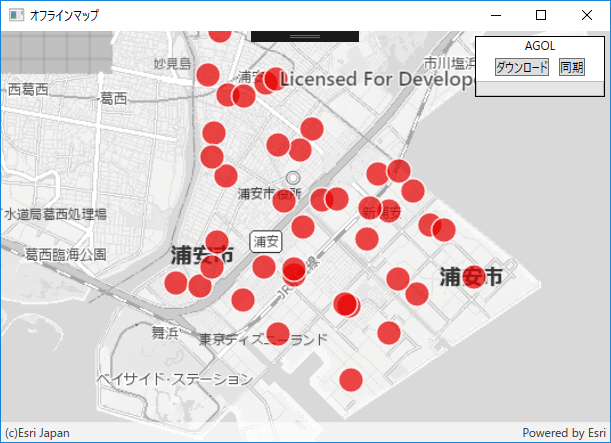
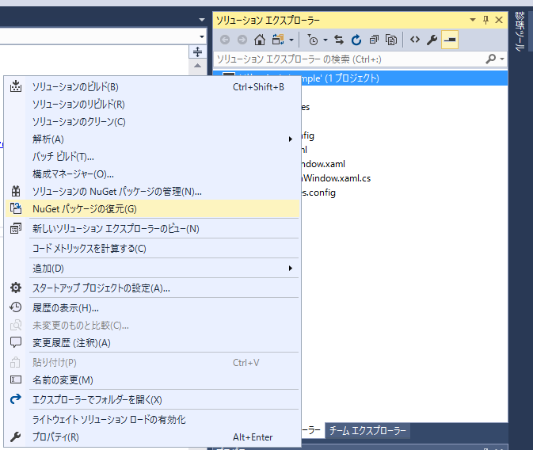
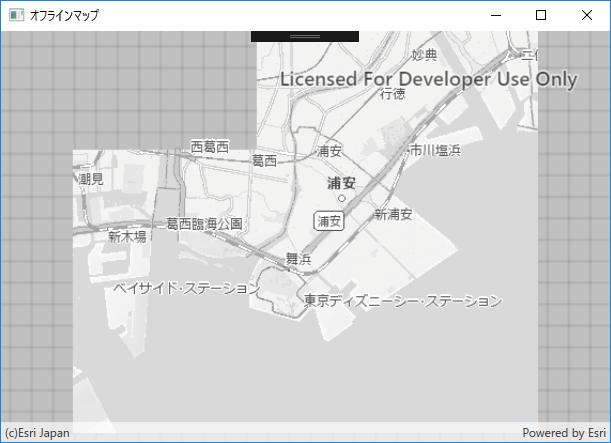
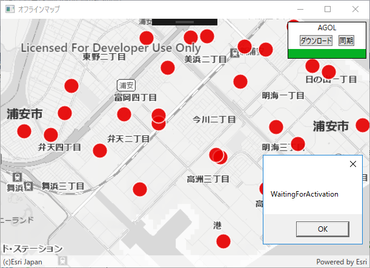

# オフラインアプリ開発手順書

## 概要

これは、ArcGIS Runtime SDK と Esri のクラウドサービス　[ArcGIS Online](http://www.arcgis.com/features/index.html) を使用してオフラインアプリを作るハンズオンです。
ArcGIS Runtime SDK には　[iOS](https://developers.arcgis.com/ios/latest/) / [Android](https://developers.arcgis.com/android/latest/) / [.NET](https://developers.arcgis.com/net/latest/) の開発環境があります。今回のハンズオンでは [ArcGIS Runtime SDK for .NET](https://developers.arcgis.com/net/latest/) を利用します。

### 使用するデータ
- 背景地図：[タイル パッケージ](https://desktop.arcgis.com/ja/arcmap/latest/map/working-with-arcmap/about-tile-packages.htm)（ArcGIS Desktop で作成）
 * ESRIジャパン データコンテンツのスターターパックに含まれる[公共地図](https://www.esrij.com/products/data-content-starter/details/kokyo/)を使用
- 主題図：[フィーチャ サービス](http://doc.arcgis.com/ja/arcgis-online/share-maps/publish-features.htm)（ArcGIS Online で配信）
 * デモ用の保育園・幼稚園データ（浦安市の保育園・幼稚園のオープンデータをもとに作成）
 * フィーチャ サービスの URL（Rest エンドポイント）: https://services.arcgis.com/wlVTGRSYTzAbjjiC/ArcGIS/rest/services/urayasushi_hoikuen_yochien/FeatureServer
 * ArcGIS.com マップ ビューアーで[データを確認してみる](https://www.arcgis.com/home/webmap/viewer.html?webmap=49aaf6580c9142e28d8912cee6f573c9)


## 今回 作るものは？
通信が制限されている状況で地図上にプロットしてポイントデータを作成し、作成したポイントデータをオンライン環境時に ArcGIS Online のフィーチャ レイヤーと同期するオフラインアプリを作成します。


### 実装後のアプリ


### 実装する機能
- タイル パッケージ（背景地図）の表示
- フィーチャ サービス（主題図）の表示
- フィーチャ サービスのデータのダウンロード
- フィーチャの編集（ポイント追加）
- 編集結果をフィーチャ サービスと同期

## 開発環境

### Windows
|サポート OS|最大バージョン|
|----|----|
|Windows 10||
|Windows 8.1||
|Windows 7| SP1|
|Windows 10||

### サポート開発環境
- Visual Studio 2017
- Visual Studio 2015 Update 3
- Visual Studio Express 2015 for Windows Desktop Update 3
- Visual Studio 2013 Update 5
- Visual Studio Express 2013 for Windows Desktop Update 5
- Visual Studio 2012 Update 4
- Visual Studio Express 2012 for Windows Desktop Update 4

### SDK の要件
Microsoft .NET Framework 4.5.2（最小バージョン）

詳細については[システム要件](https://developers.arcgis.com/net/latest/forms/guide/system-requirements.htm)を参照してください。

## 手を動かそう

それではここから実際に手を動かしながらやっていきましょう。

【準備】
まず、ハンズオンのレポジトリをクローンまたはダウンロードしてローカルに保存し、開いておいてください。
https://github.com/EsriJapan/workshops


## 手順 1: ソリューションファイルを開く
Visual Studio で `workshops/offlinemap-app-hands-on/hands-on/DotNet/examples/start` ディレクトリの中にある「`sample.sln`」を開いてください。

ソリューションエクスプローラーを見ると、以下の構成になっています。


### NuGet パッケージの復元

すべてのプロジェクトにおいて、必要な NuGet パッケージはすべてインストール済みとなっています。ですので、このハンズオンでは、新たにパッケージを追加でインストールする必要はありません。しかし、プロジェクトをビルドするためには、まず最初にすべての NuGet パッケージを復元する必要があります。

ソリューションエクスプローラーの中の『ソリューション'sample'』を 右クリックして、『`NuGet パッケージの復元`』をクリックします。



### 手順 2: タイル パッケージ（背景地図）の表示

NuGet パッケージの復元が完了したら、デバッグを開始してアプリを実行してみましょう。<br/>
以下のような画面が表示されます。


現在、ArcGIS Online の背景地図を表示していますが、今回は、オフライン環境ですので、背景地図はタイルパッケージを表示するように変更します。
今回は事前に作成したタイルパッケージがありますので、ダウンロードした `workshops/offlinemap-app-hands-on/samples/SampleData/public_map.tpk` を使用します。

### MainWindow.xaml.cs

次に背景地図を表示する部分を作成します。

1. プロジェクトの `sample/MainWindow.xaml.cs` ファイルを開きます。
2. 以下のような内容で背景地図を呼び出す部分を変更します。

```csharp
public void Initialize()
{
    myMap = new Map();

    TileCache tileCache = new TileCache(@"C:\workshops\offlinemap-app-hands-on\samples\SampleData\public_map.tpk");
    ArcGISTiledLayer tiledLayer = new ArcGISTiledLayer(tileCache);

    LayerCollection baseLayers = new LayerCollection();
    baseLayers.Add(tiledLayer);
    myMap.Basemap.BaseLayers = baseLayers;

    MyMapView.Map = myMap;
}
```
### アプリの実行

アプリを実行して確認しましょう。<br/>
以下のような画面が表示されます。



## 手順 3: フィーチャ サービス（主題図）の表示

主題図：[フィーチャ サービス](http://doc.arcgis.com/ja/arcgis-online/share-maps/publish-features.htm)を表示してみましょう。
 * デモ用の保育園・幼稚園データ（浦安市の保育園・幼稚園のオープンデータをもとに作成）
 
1. プロジェクトの `sample/MainWindow.xaml.cs` ファイルを開きます。
2. 以下のような内容でフィーチャ サービスの表示部分を作成します。

```csharp
public void Initialize()
{
    myMap = new Map();

    TileCache tileCache = new TileCache(@"D:\workshops\offlinemap-app-hands-on\samples\SampleData\public_map.tpk");
    ArcGISTiledLayer tiledLayer = new ArcGISTiledLayer(tileCache);

    LayerCollection baseLayers = new LayerCollection();
    baseLayers.Add(tiledLayer);
    myMap.Basemap.BaseLayers = baseLayers;

    // 主題図の表示
    addFeatureLayer();

    MyMapView.Map = myMap;

}

/**
* 主題図の表示をする
**/
public void addFeatureLayer()
{
    // 主題図用のフィーチャ レイヤー（フィーチャ サービス）の表示
    // フィーチャ サービスの URL を指定してフィーチャ テーブル（ServiceFeatureTable）を作成する
    // フィーチャ サービスの URL はレイヤー番号（〜/FeatureServer/0）まで含める
    var serviceUri = new Uri(FEATURELAYER_SERVICE_URL + "/0");
    ServiceFeatureTable featureTable = new ServiceFeatureTable(serviceUri);
    // フィーチャ テーブルからフィーチャ レイヤーを作成
    featureLayer = new FeatureLayer(featureTable);
    // マップにフィーチャ レイヤーを追加
    myMap.OperationalLayers.Add(featureLayer);
}
```
### アプリの実行

アプリを実行して確認しましょう。<br/>
以下のような画面が表示されます。


## 手順 4: フィーチャ サービスのデータのダウンロード

オフライン環境においてデータの参照や書き込みを行うために ローカル上に Runtime コンテンツ（*.geodatabase）を作成する必要があります。作成した Runtime コンテンツ（*.geodatabase）を参照して地図に表示します。

ここでは フィーチャ サービスのデータをダウンロードして、ダウンロードしたデータから Runtime コンテンツ（*.geodatabase）を新規に作成し、作成した Runtime コンテンツ（*.geodatabase）を地図に表示する部分を書いていきます。
また、Runtime コンテンツ（*.geodatabase）が存在している場合は 既存の Runtime コンテンツ（*.geodatabase）を読み込むようにします。

Runtime コンテンツ（*.geodatabase）で使用するデータは、こちらの[フィーチャ レイヤー](https://services.arcgis.com/wlVTGRSYTzAbjjiC/arcgis/rest/services/urayasushi_hoikuen_yochien/FeatureServer)を使用していきます。

### MainWindow.xaml

Runtime コンテンツ（*.geodatabase）を作成するためにデータのダウンロード ボタンを追加します。<br/>
ダウンロード ボタンがクリックされたら ArcGIS Online の[フィーチャ レイヤー](https://services.arcgis.com/wlVTGRSYTzAbjjiC/arcgis/rest/services/urayasushi_hoikuen_yochien/FeatureServer)からデータをダウンロードして、Runtime コンテンツ（*.geodatabase）を作成します。

1. プロジェクトの `sample/MainWindow.xaml` ファイルを開きます。
2. 次に、Grid の中に次の要素を追加します。

```xml
<Border Name="uiPanel" 
    Background="White" BorderBrush="Black" BorderThickness="1"
    HorizontalAlignment="Right" VerticalAlignment="Top"
    Margin="5" Width="130">
    <StackPanel>
	<TextBlock Text="AGOL"
	   HorizontalAlignment="Center"
	   Margin="0,0,0,0" 
	   TextWrapping="Wrap" />
	<WrapPanel Grid.Row="0" Grid.Column="0" HorizontalAlignment="Center">
	    <Button Content="ダウンロード"
		HorizontalAlignment="Left"
		Margin="5"
		Padding="0"    
		VerticalAlignment="Top"
		Width="auto"
		Click="OnDonwloadButton" 
		ToolTip="サーバー(AGOL)からダウンロードを行います"/>
	</WrapPanel>
	<ProgressBar x:Name="MyProgressBar" Visibility="Visible" MinHeight="15" />
    </StackPanel>
</Border>
```

【確認】現在、`MainWindow.xaml`は、次のようになっているはずです。

```xml
<Window x:Class="sample.MainWindow"
        xmlns="http://schemas.microsoft.com/winfx/2006/xaml/presentation"
        xmlns:x="http://schemas.microsoft.com/winfx/2006/xaml"
        xmlns:d="http://schemas.microsoft.com/expression/blend/2008"
        xmlns:mc="http://schemas.openxmlformats.org/markup-compatibility/2006"
        xmlns:esri="http://schemas.esri.com/arcgis/runtime/2013"
        xmlns:local="clr-namespace:sample"
        mc:Ignorable="d"
        Title="オフラインマップ" Height="450" Width="625">

    <Grid>
        <esri:MapView x:Name="MyMapView"/>

        <Border Name="uiPanel" 
            Background="White" BorderBrush="Black" BorderThickness="1"
            HorizontalAlignment="Right" VerticalAlignment="Top"
            Margin="5" Width="130">
            <StackPanel>
                <TextBlock Text="AGOL"
                   HorizontalAlignment="Center"
                   Margin="0,0,0,0" 
                   TextWrapping="Wrap" />
                <WrapPanel Grid.Row="0" Grid.Column="0" HorizontalAlignment="Center">
                    <Button Content="ダウンロード"
                        HorizontalAlignment="Left"
                        Margin="5"
                        Padding="0"    
                        VerticalAlignment="Top"
                        Width="auto"
                        Click="OnDonwloadButton" 
                        ToolTip="サーバー(AGOL)からダウンロードを行います"/>
                </WrapPanel>
                <ProgressBar x:Name="MyProgressBar" Visibility="Visible" MinHeight="15" />
            </StackPanel>
        </Border>
	
    </Grid>
</Window>
```

### MainWindow.xaml.cs

1. プロジェクトの `sample/MainWindow.xaml.cs` ファイルを開きます。
2. `Initialize` 関数に `chkGeodatabase()` 関数を作成します。

```csharp
public async void Initialize()
{
    myMap = new Map();

    TileCache tileCache = new TileCache(@"D:\workshops\offlinemap-app-hands-on\samples\SampleData\public_map.tpk");
    ArcGISTiledLayer tiledLayer = new ArcGISTiledLayer(tileCache);

    LayerCollection baseLayers = new LayerCollection();
    baseLayers.Add(tiledLayer);
    myMap.Basemap.BaseLayers = baseLayers;

    // 主題図の表示
    addFeatureLayer();

    MyMapView.Map = myMap;

    // PC内の geodatabase ファイル作成パスを取得する
    getGeodatabasePath();
}
```

3. `getGeodatabasePath()` 関数を作成します。

```csharp
////////////////////////////////////////////////////////////////////////////////////////
// 端末ローカルのパスまわり
////////////////////////////////////////////////////////////////////////////////////////
/**
* geodatabaseファイル作成のパスを取得する
**/
private String mGeodatabasePath;
private void getGeodatabasePath()
{
    // カレントディレクトリの取得
    string stCurrentDir = System.Environment.CurrentDirectory;

    // カレントディレクトリを表示する
    //MessageBox.Show(stCurrentDir);

    mGeodatabasePath = stCurrentDir + "\\" + "orglayer.geodatabase";
}
```

4. ダウンロード ボタンがクリックされた処理を作成します。

```csharp
private void OnDonwloadButton(object sender, RoutedEventArgs e)
{
    // すでにランタイムコンテンツが作成されているかチェックする
    chkGeodatabase();
}
```

5. `chkGeodatabase()` 関数で Runtime コンテンツ（*.geodatabase）の作成の可否をチェックします。

```csharp
/**
* ローカルファイルをMapViewへ追加する
* */
private void chkGeodatabase()
{
    // カレントディレクトリの取得
    string stCurrentDir = System.Environment.CurrentDirectory;

    mGeodatabasePath = stCurrentDir + "\\" + "orglayer.geodatabase";

    if (System.IO.File.Exists(mGeodatabasePath))
    {
        // 存在する場合は、既存のgeodatabaseから読み込む
        readGeoDatabase();
    }
    else
    {
        // ファイル作成メソッドをcallする
        createGeodatabaseSyncTask();
    }
}
```

6. 既存 GeoDatabase から読み込む、`readGeoDatabase()`関数を作成します。

```csharp
/**
 * 既存 GeoDatabase から読み込む
 ****/
private GeodatabaseFeatureTable mGdbFeatureTable;
private FeatureLayer mFeatureLayer;
private Geodatabase geodatabase;
private async void readGeoDatabase()
{
    geodatabase = await Geodatabase.OpenAsync(mGeodatabasePath);

    if (geodatabase.GeodatabaseFeatureTables.Count > 0)
    {
        // データベース内の最初のテーブルを取得する
        mGdbFeatureTable = geodatabase.GeodatabaseFeatureTables.FirstOrDefault();

        await mGdbFeatureTable.LoadAsync();

        if (mGdbFeatureTable.LoadStatus == LoadStatus.Loaded)
        {
            mFeatureLayer = new FeatureLayer(mGdbFeatureTable);

            myMap.OperationalLayers.Add(mFeatureLayer);
        }
    }
}
```

7. ローカルフォルダに Runtime コンテンツ（*.geodatabase）を作成します。

 Runtime コンテンツ（*.geodatabase）の作成は、ステップ①、②、③ の手順で行っていきます。

- ① 同期させたいArcGIS Online の Feature Layer でタスクを作成する。
- ② 同期させたいArcGIS Online の Feature Layer のパラメータを取得する。
- ③ 同期させたいArcGIS Online の Feature Layer でローカル geodatabase を作成する。

 コードの TODO 箇所に処理を書いていきましょう。<br/>
 詳細は、 [Runtime コンテンツ（*.geodatabase）の作成](https://developers.arcgis.com/net/latest/wpf/guide/create-an-offline-layer.htm)を参考にしてください。
 
```csharp
////////////////////////////////////////////////////////////////
// ローカルフォルダにランタイムコンテンツ(*.geodatabase)作成
// 【概要】
//　① 同期させたいArcGIS Online の Feature Layer でタスクを作成する
//　② 同期させたいArcGIS Online の Feature Layer のパラメータを取得する
//　③ 同期させたいArcGIS Online の Feature Layer でローカル geodatabase を作成する
////////////////////////////////////////////////////////////////

private GeodatabaseSyncTask geodatabaseSyncTask;
private GenerateGeodatabaseParameters generateParams;
private GenerateGeodatabaseJob generateJob;
/**
 * GeoDatabaseを新規に作成する
 * ① 同期させたいArcGIS Online の Feature Layer でタスクを作成する
 ****/
private async void createGeodatabaseSyncTask()
{
    // TODO 同期させたいレイヤーで geodatabase 作成 タスクオブジェクトを作成する
            
    // ② 同期させたいArcGIS Online の Feature Layer のパラメータを取得する
    generateGeodatabaseParameters();
}

/**
 * GeoDatabaseを新規に作成する
 * ② 同期させたいArcGIS Online の Feature Layer のパラメータを取得する
 **/
private async void generateGeodatabaseParameters()
{
    // TODO geodatabase 作成のためのパラメータを取得する

    // TODO レイヤーごとに同期を設定する 

    // TODO 添付ファイルは返さない

    // ③ 同期させたいArcGIS Online の Feature Layer でローカル geodatabase を作成する
    generateGeodatabase();
}

/**
 * GeoDatabaseを新規に作成する
 * ③ 同期させたいArcGIS Online の Feature Layer でローカル geodatabase を作成する
 **/
private void generateGeodatabase()
{
    // TODO geodatabaseファイル作成ジョブオブヘジェクトを作成する

    // JobChanged イベントを処理してジョブのステータスをチェックする
    generateJob.JobChanged += (s, e) =>
    {
	// report error (if any)
	if (generateJob.Error != null)
	{
	    Console.WriteLine("Error creating geodatabase: " + generateJob.Error.Message);
	    return;
	}

	// check the job status
	if (generateJob.Status == JobStatus.Succeeded)
	{
	    // ジョブが成功した場合はローカルデータをマップに追加する
	    readGeoDatabase();
	}
	else if (generateJob.Status == JobStatus.Failed)
	{
	    // report failure
	    Console.WriteLine("Unable to create local geodatabase.");
	}
	else
	{
	    // job is still running, report last message
	    Console.WriteLine(generateJob.Messages[generateJob.Messages.Count - 1].Message);
	}
    };

    generateJob.ProgressChanged += ((object sender, EventArgs e) =>
    {
	this.Dispatcher.Invoke(() =>
	{
	    MyProgressBar.Value = generateJob.Progress / 1.0;
	});
    });

    // ジョブを開始し、ジョブIDをコンソール上に表示
    generateJob.Start();

    Console.WriteLine("Submitted job #" + generateJob.ServerJobId + " to create local geodatabase");
}
```

【確認】現在、`createGeodatabaseSyncTask()`、`generateGeodatabaseParameters()`、`generateGeodatabase()`関数は、次のようになっているはずです。

```csharp
/**
 * GeoDatabaseを新規に作成する
 * ① 同期させたいArcGIS Online の Feature Layer でタスクを作成する
 ****/
private async void createGeodatabaseSyncTask()
{
    // TODO 同期させたいレイヤーで geodatabase 作成 タスクオブジェクトを作成する
    var featureServiceUri = new Uri(FEATURELAYER_SERVICE_URL);
    geodatabaseSyncTask = await GeodatabaseSyncTask.CreateAsync(featureServiceUri);
            
    // ② 同期させたいArcGIS Online の Feature Layer のパラメータを取得する
    generateGeodatabaseParameters();
}

/**
 * GeoDatabaseを新規に作成する
 * ② 同期させたいArcGIS Online の Feature Layer のパラメータを取得する
 **/
private async void generateGeodatabaseParameters()
{
    // TODO geodatabase 作成のためのパラメータを取得する
    Envelope extent = MyMapView.GetCurrentViewpoint(ViewpointType.BoundingGeometry).TargetGeometry as Envelope;
    generateParams = await geodatabaseSyncTask.CreateDefaultGenerateGeodatabaseParametersAsync(extent);

    // TODO レイヤーごとに同期を設定する 
    generateParams.SyncModel = SyncModel.Layer;

    // TODO 添付ファイルは返さない
    generateParams.ReturnAttachments = false;

    // ③ 同期させたいArcGIS Online の Feature Layer でローカル geodatabase を作成する
    generateGeodatabase();
}

/** GeoDatabaseを新規に作成する
 * ③ 同期させたいArcGIS Online の Feature Layer でローカル geodatabase を作成する
 **/
private void generateGeodatabase()
{
    // TODO geodatabaseファイル作成ジョブオブヘジェクトを作成する
    generateJob = geodatabaseSyncTask.GenerateGeodatabase(generateParams, mGeodatabasePath);

    // JobChanged イベントを処理してジョブのステータスをチェックする
    generateJob.JobChanged += (s, e) =>
    {
	// report error (if any)
	if (generateJob.Error != null)
	{
	    Console.WriteLine("Error creating geodatabase: " + generateJob.Error.Message);
	    return;
	}

	// check the job status
	if (generateJob.Status == JobStatus.Succeeded)
	{
	    // ジョブが成功した場合はローカルデータをマップに追加する
	    readGeoDatabase();
	}
	else if (generateJob.Status == JobStatus.Failed)
	{
	    // report failure
	    Console.WriteLine("Unable to create local geodatabase.");
	}
	else
	{
	    // job is still running, report last message
	    Console.WriteLine(generateJob.Messages[generateJob.Messages.Count - 1].Message);
	}
	
    };

    generateJob.ProgressChanged += ((object sender, EventArgs e) =>
    {
	this.Dispatcher.Invoke(() =>
	{
	    MyProgressBar.Value = generateJob.Progress / 1.0;
	});
    });

    // ジョブを開始し、ジョブIDをコンソール上に表示
    generateJob.Start();

    Console.WriteLine("Submitted job #" + generateJob.ServerJobId + " to create local geodatabase");
}
```

【確認】ここまでの `MainWindow.xaml`、`MainWindow.xaml.cs` を確認したい方は [こちら](examples/手順4)にございます。

### アプリの実行

アプリを実行して確認しましょう。<br/>
以下のような画面が表示されます。


## 手順 5: フィーチャの編集（ポイント追加）

新しいポイントを Runtime コンテンツ（*.geodatabase）に追加する処理を書いていきましょう。

### MainWindow.xaml.cs

1. プロジェクトの `sample/MainWindow.xaml.cs` ファイルを開きます。
2. `Initialize` 関数に `MyMapView.GeoViewTapped += OnMapViewTapped;` 追加します。これは地図をタップしたときのイベントを実行するための処理になります。

```csharp
public void Initialize()
{
    myMap = new Map();

    TileCache tileCache = new TileCache(@"D:\workshops\offlinemap-app-hands-on\samples\SampleData\public_map.tpk");
    ArcGISTiledLayer tiledLayer = new ArcGISTiledLayer(tileCache);

    LayerCollection baseLayers = new LayerCollection();
    baseLayers.Add(tiledLayer);
    myMap.Basemap.BaseLayers = baseLayers;

    // 主題図の表示
    addFeatureLayer();

    MyMapView.Map = myMap;

    // PC内の geodatabase ファイル作成パスを取得する
    getGeodatabasePath();

    MyMapView.GeoViewTapped += OnMapViewTapped;
}
```

3. 地図をタップしたイベントの処理を作成していきます。地図をタップした箇所にポイントデータを作成して、作成したポイントデータは ローカル geodatabase に追加していきます。

```csharp
private void OnMapViewTapped(object sender, GeoViewInputEventArgs e)
{
    try
    {
        // get the click point in geographic coordinates
        var mapClickPoint = e.Location;
        addPoint(mapClickPoint);
    }
    catch (Exception ex)
    {
        MessageBox.Show("Sample error", ex.ToString());
    }
}

////////////////////////////////////////////////////////////////
// 追加
////////////////////////////////////////////////////////////////
/**
 * 新しいポイントを追加する
 * From touch eventから
 **/
private void addPoint(MapPoint structureLocation)
{
    MapPoint wgs84Point = (MapPoint)GeometryEngine.Project(structureLocation, SpatialReferences.Wgs84);
    addFeature(wgs84Point);
}

/**
 * ローカルgeodatabaseにポイントを追加する
 **/
private async void addFeature(MapPoint pPoint)
{
    if (mGdbFeatureTable == null)
    {
	return;
    }

    if (!mGdbFeatureTable.CanAdd())
    {
        // Deal with indicated error
        return;
    }

    // 項目にデータを入れる
    var attributes = new Dictionary<string, object>();
    attributes.Add("name", "ESRIジャパンnow！");

    Feature addedFeature = mGdbFeatureTable.CreateFeature(attributes, pPoint);

    await mGdbFeatureTable.AddFeatureAsync(addedFeature);

    FeatureQueryResult results = await mGdbFeatureTable.GetAddedFeaturesAsync();

    foreach (var r in results)
    {
        Console.WriteLine("add point geodatabase : '" + r.Attributes["name"]);
    }
}
```

【確認】ここまでの `MainWindow.xaml`、`MainWindow.xaml.cs` を確認したい方は [こちら](examples/手順5)にございます。

### アプリの実行

アプリを実行して確認しましょう。<br/>
以下のような画面が表示され、地図をタップすることでポイントが追加されます。


## 手順 6: 編集結果をフィーチャ サービスと同期

最後に Runtime コンテンツ（*.geodatabase）に追加したポイントを ArcGIS Online の[フィーチャ レイヤー](https://services.arcgis.com/wlVTGRSYTzAbjjiC/arcgis/rest/services/urayasushi_hoikuen_yochien/FeatureServer)と同期する処理を書いていきましょう。

### MainWindow.xaml

1. プロジェクトの `sample/MainWindow.xaml` ファイルを開きます。
2. 次に、StackPanel の WrapPanel の中に次の要素を追加します。

```xml
<Button Content="同期"
	HorizontalAlignment="Left"
	Margin="5"
	Padding="0"    
	VerticalAlignment="Top"
	Width="auto"
	Click="OnSyncClick" 
	ToolTip="サーバー(AGOL)との同期を行います"/>
```

【確認】現在、`MainWindow.xaml`は、次のようになっているはずです。

```xml
<Window x:Class="sample.MainWindow"
        xmlns="http://schemas.microsoft.com/winfx/2006/xaml/presentation"
        xmlns:x="http://schemas.microsoft.com/winfx/2006/xaml"
        xmlns:d="http://schemas.microsoft.com/expression/blend/2008"
        xmlns:mc="http://schemas.openxmlformats.org/markup-compatibility/2006"
        xmlns:esri="http://schemas.esri.com/arcgis/runtime/2013"
        xmlns:local="clr-namespace:sample"
        mc:Ignorable="d"
        Title="オフラインマップ" Height="450" Width="625">

    <Grid>
        <esri:MapView x:Name="MyMapView"/>
        <Border Name="uiPanel" 
            Background="White" BorderBrush="Black" BorderThickness="1"
            HorizontalAlignment="Right" VerticalAlignment="Top"
            Margin="5" Width="130">
            <StackPanel>
                <TextBlock Text="AGOL"
                   HorizontalAlignment="Center"
                   Margin="0,0,0,0" 
                   TextWrapping="Wrap" />
                <WrapPanel Grid.Row="0" Grid.Column="0" HorizontalAlignment="Center">
                    <Button Content="ダウンロード"
                        HorizontalAlignment="Left"
                        Margin="5"
                        Padding="0"    
                        VerticalAlignment="Top"
                        Width="auto"
                        Click="OnDonwloadButton" 
                        ToolTip="サーバー(AGOL)からダウンロードを行います"/>
                    <Button Content="同期"
                        HorizontalAlignment="Left"
                        Margin="5"
                        Padding="0"    
                        VerticalAlignment="Top"
                        Width="auto"
			IsEnabled="False"
                        Click="OnSyncClick" 
                        ToolTip="サーバー(AGOL)との同期を行います"/>
                </WrapPanel>
                <ProgressBar x:Name="MyProgressBar" Visibility="Visible" MinHeight="15" />
            </StackPanel>
        </Border>
    </Grid>
</Window>
```

### MainWindow.xaml.cs

1. プロジェクトの `sample/MainWindow.xaml.cs` ファイルを開きます。

2. ダウンロードボタンがクリックされたら同期ボタンを有効にします。
```csharp
private void OnDonwloadButton(object sender, RoutedEventArgs e)
{
    // すでにランタイムコンテンツが作成されているかチェックする
    chkGeodatabase();

    // 同期ボタンの有効
    MyButton.IsEnabled = true;
}
```

3. 以下のようにフィーチャ レイヤーと同期する処理を作成します。
```csharp
////////////////////////////////////////////////////////////////
// 同期
////////////////////////////////////////////////////////////////
/**
 * サーバー(AGOL)と同期する
 * ① 同期タスクを作成する
 * ② 同期パラメータを取得する
 **/
private async void OnSyncClick(object sender, RoutedEventArgs e)
{
    // 同期したいレイヤーでタスクオブジェクトを作成する
    geodatabaseSyncTask = await GeodatabaseSyncTask.CreateAsync(new Uri(FEATURELAYER_SERVICE_URL));

    readGeoDatabase();

    // タスクオブジェクトから同期するためのパラメータを作成する
    syncParams = await geodatabaseSyncTask.CreateDefaultSyncGeodatabaseParametersAsync(geodatabase);

    // パラーメータを使用してgeodatabaseを同期する
    syncGeodatabase();
}

/**
* サーバー(AGOL)と同期する
* ③ 同期ジョブを作成する
* ④ 同期する
* */
private SyncGeodatabaseJob syncJob;
private void syncGeodatabase()
{
    // 同期ジョブオブヘジェクトを作成する
    syncJob = geodatabaseSyncTask.SyncGeodatabase(syncParams, geodatabase);

    syncJob.JobChanged += (s, e) =>
    {
        // 同期ジョブが終了したときのステータスを検査する
        if (syncJob.Status == JobStatus.Succeeded)
        {
            // 同期完了から返された値を取得する
            var result = syncJob.GetResultAsync();
            if (result != null)
            {
                // 同期結果を確認して、例えばユーザに通知する処理を作成します
                ShowStatusMessage(result.Status.ToString());
            }
        }
        else if (syncJob.Status == JobStatus.Failed)
        {
            // エラーの場合
            ShowStatusMessage(syncJob.Error.Message);
        }
        else
        {
            var statusMessage = "";
            var m = from msg in syncJob.Messages select msg.Message;
            statusMessage += ": " + string.Join<string>("\n", m);

            Console.WriteLine(statusMessage);
        }
    };

    syncJob.ProgressChanged += ((object sender, EventArgs e) =>
    {
	this.Dispatcher.Invoke(() =>
	{
	    MyProgressBar.Value = syncJob.Progress / 1.0;
	});
    });

    // geodatabase 同期のジョブを開始します
    syncJob.Start();
}

private void ShowStatusMessage(string message)
{
    MessageBox.Show(message);
}
```

【確認】ここまでの `MainWindow.xaml`、`MainWindow.xaml.cs` を確認したい方は [こちら](examples/手順6)にございます。

### アプリの実行

アプリを実行して確認しましょう。<br/>
以下のような画面が表示され、画面右上の同期ボタンをクリックすることフィーチャ レイヤーとの同期が実行されます。



## 最後: 同期されたフィーチャ レイヤーの確認

実際に ArcGIS Online にアクセスして新規に追加されたポイントデータが反映されているか確認しましょう。
同期がうまくいった場合は新規のポイントデータが追加されています。


[ArcGIS Online 上で表示](http://www.arcgis.com/home/webmap/viewer.html?webmap=49aaf6580c9142e28d8912cee6f573c9)
