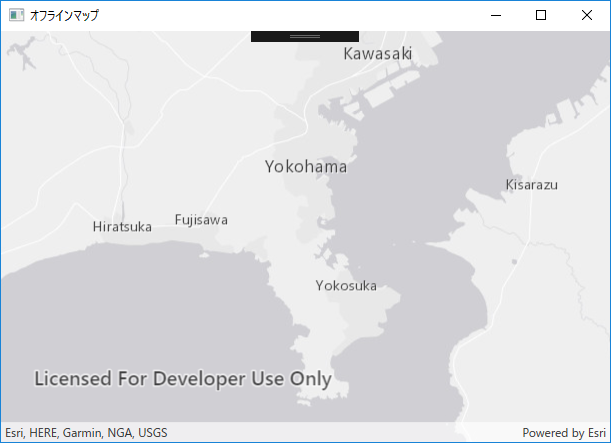
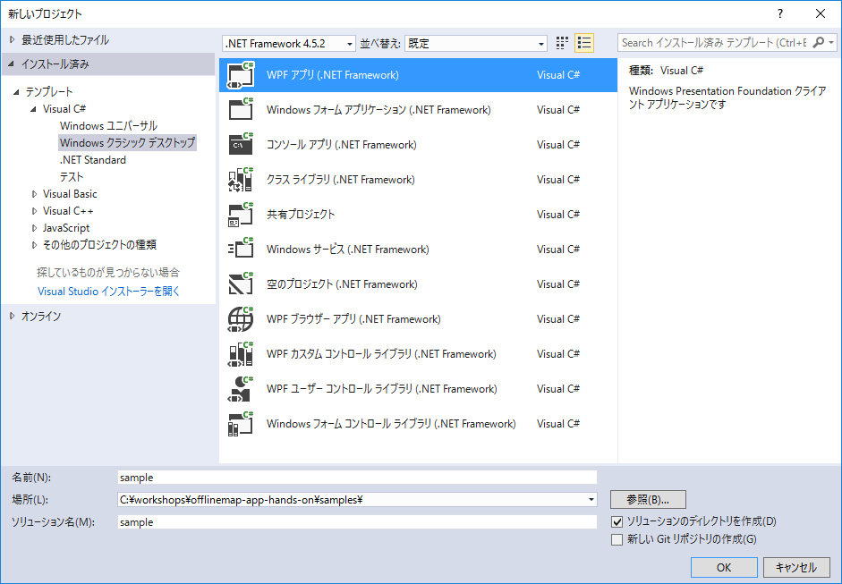
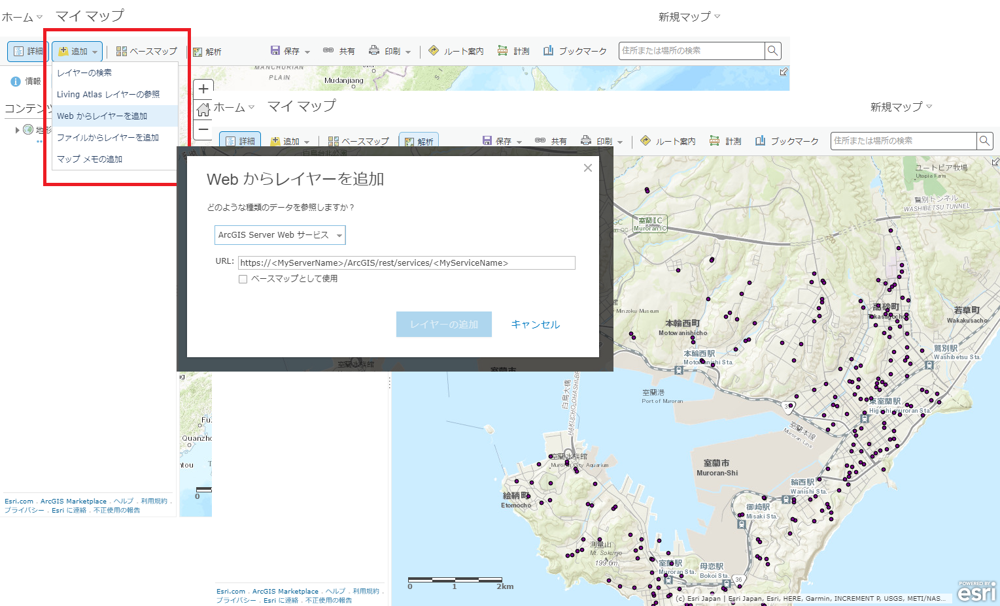
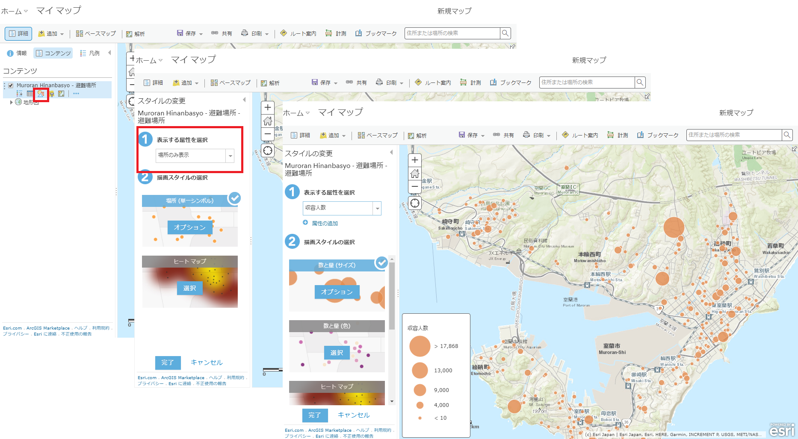
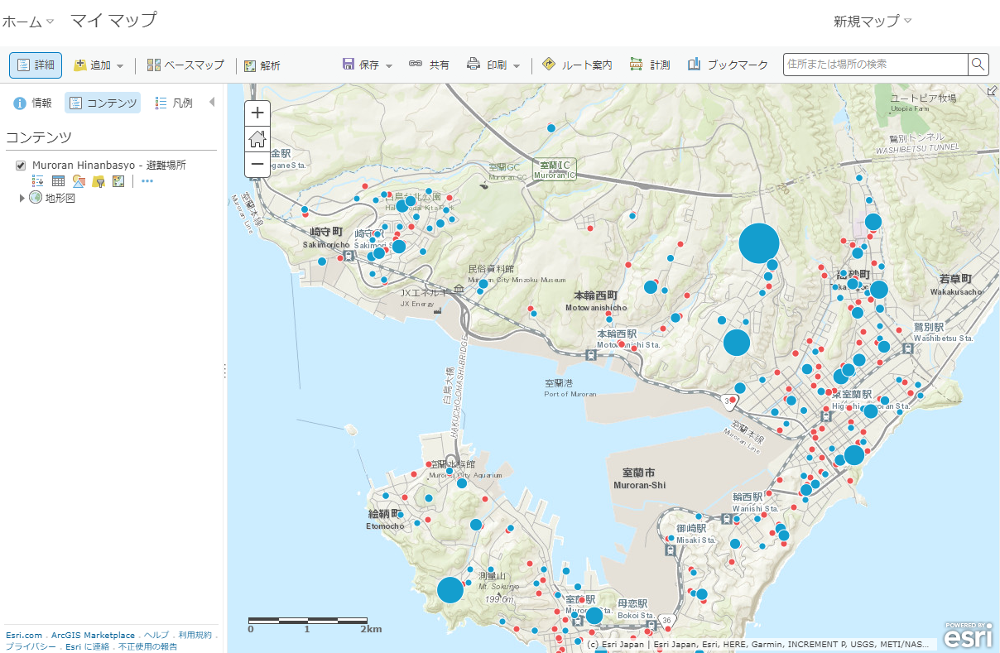
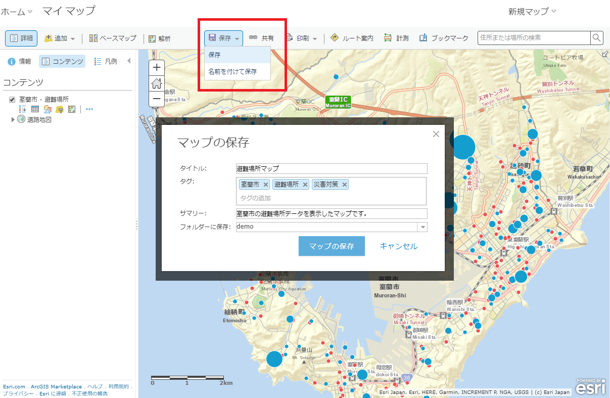
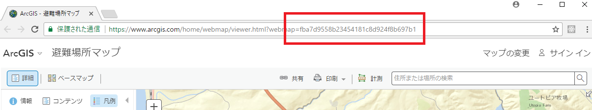

# オフラインアプリ開発手順書

## 概要

これは、ArcGIS Runtime SDK と Esri のクラウドサービス　[ArcGIS Online](http://www.arcgis.com/features/index.html) を使用してオフラインアプリを作るハンズオンです。
ArcGIS　Runtime SDK には　[iOS](https://developers.arcgis.com/ios/latest/) / [Android](https://developers.arcgis.com/android/latest/) / [.NET](https://developers.arcgis.com/net/latest/) の開発環境があります。今回のオフラインアプリの開発には [ArcGIS Runtime SDK for .NET](https://developers.arcgis.com/net/latest/) を利用します。

## 今回 作るものは？
通信が制限されている状況で地図上にプロットしてポイントデータを作成し、作成したポイントデータをオンライン環境時に　ArcGIS Online のフィーチャ レイヤーと同期するオフラインアプリを作成します。

## 開発環境 (Windows)
|サポート OS|最大バージョン|
|----|----|
|Windows 10||
|Windows 8.1||
|Windows 7| SP1|
|Windows 10||

### サポート開発環境
- Visual Studio 2017
- Visual Studio 2015 Update 3
- Visual Studio Express 2015 for Windows Desktop Update 3
- Visual Studio 2013 Update 5
- Visual Studio Express 2013 for Windows Desktop Update 5
- Visual Studio 2012 Update 4
- Visual Studio Express 2012 for Windows Desktop Update 4

### SDK の要件
Microsoft .NET Framework 4.5.2（最小バージョン）

詳細については[システム要件](https://developers.arcgis.com/net/latest/forms/guide/system-requirements.htm)を参照してください。

## 手を動かそう

それではここから実際に手を動かしながらやっていきましょう。

### 手順 1: プロジェクトの作成

 
### 手順 2: ArcGIS Runtime SDK NuGet パッケージのインストール


### 手順 3: 地図表示

地図を表示する部分 ユーザーインタフェースとして、**sample/MainWindow.xaml** に UI を作成していきます。
地図表示（ユーザインタフェース）は **XAML**(ざむる)という、マークアップ言語で書いていきます。(Extensible Application Markup Language)

#### MainWindow.xaml

まず、MapView コントロールをページに追加するには、XAML 名前空間を割り当てる必要があります。
次のように XML 名前空間の参照を WindowContentPage の XAML 要素に追加します。

```xml
  xmlns:esri="http://schemas.esri.com/arcgis/runtime/2013"
```
ArcGIS Runtime API のすべてのXAML要素は、http://schemas.esri.com/arcgis/runtime/2013 名前空間で使用できます。

次に、Grid の中に MapView クラスを追加します：

```xml
  <Grid>
     <esri:MapView x:Name="MyMapView"/>
  </Grid>
```
【確認】現在、`MainWindow.xaml`は、次のようになっているはずです。

```xml
<Window x:Class="sample.MainWindow"
        xmlns="http://schemas.microsoft.com/winfx/2006/xaml/presentation"
        xmlns:x="http://schemas.microsoft.com/winfx/2006/xaml"
        xmlns:d="http://schemas.microsoft.com/expression/blend/2008"
        xmlns:mc="http://schemas.openxmlformats.org/markup-compatibility/2006"
        xmlns:esri="http://schemas.esri.com/arcgis/runtime/2013"
        xmlns:local="clr-namespace:sample"
        mc:Ignorable="d"
        Title="オフラインマップ" Height="450" Width="625">
 
 <Grid>
    <esri:MapView x:Name="MyMapView"/>
 </Grid>

</ContentPage>
```

#### MainWindow.xaml.cs

次に背景地図を表示する部分を作成します。

1. プロジェクトの中の `sample/MainWindow..xaml.cs` ファイルを開きます。
2. 以下のような内容で 背景地図 を呼び出す部分を作成していきます。

```csharp
using System;
using System.Linq;
using System.Windows;
using System.Collections.Generic;

using Esri.ArcGISRuntime;
using Esri.ArcGISRuntime.Mapping;
using Esri.ArcGISRuntime.Geometry;
using Esri.ArcGISRuntime.Data;
using Esri.ArcGISRuntime.UI.Controls;
using Esri.ArcGISRuntime.Tasks;
using Esri.ArcGISRuntime.Tasks.Offline;

namespace sample
{
    /// <summary>
    /// MainWindow.xaml の相互作用ロジック
    /// </summary>
    public partial class MainWindow : Window
    {

        // ArcGIS Online フィーチャ レイヤーサービスの URL  
        private const string FEATURELAYER_SERVICE_URL = "https://services7.arcgis.com/903opF9LxIC4unCH/arcgis/rest/services/yokohamaTripPoint/FeatureServer/";

        private Map myMap;

        private SyncGeodatabaseParameters syncParams;
        
        public MainWindow()
        {
            InitializeComponent();
            
            Initialize();
        }

        public void Initialize()
        {
            myMap = new Map(BasemapType.LightGrayCanvas, 35.3312442, 139.6202471, 10);
            
            MyMapView.Map = myMap;
        }   
        
    }
}
```
#### アプリの実行

ここでアプリを実行します。
実行後の以下のような画面になります。




### 手順 4: Runtime コンテンツの作成して表示

オフライン環境においてデータの参照や書き込みを行うために Runtime コンテンツ（*.geodatabase）を作成します。
そして作成した Runtime コンテンツ（*.geodatabase）を参照して地図に表示します。

次に Runtime コンテンツ（*.geodatabase）作成して表示する部分を作成します。
Runtime コンテンツ（*.geodatabase）が存在している場合は 既存の Runtime コンテンツ（*.geodatabase）を読み込みます。

#### MainWindow.xaml.cs

1. プロジェクトの中の `sample/MainWindow..xaml.cs` ファイルを開きます。
2. Initialize 関数のなかに、getGeodatabasePath()、chkGeodatabase() 関数を作成していきます。

```csharp
public void Initialize()
{
    myMap = new Map(BasemapType.LightGrayCanvas, 35.3312442, 139.6202471, 10);

    MyMapView.Map = myMap;

    // PC内の geodatabase ファイル作成パスを取得する
    getGeodatabasePath();

    // すでにランタイムコンテンツが作成されているかチェックする
    chkGeodatabase();

}
```


```csharp
////////////////////////////////////////////////////////////////////////////////////////
// 端末ローカルのパスまわり
////////////////////////////////////////////////////////////////////////////////////////
/**
    * geodatabaseファイル作成のパスを取得する
    * */
private String mGeodatabasePath;
private void getGeodatabasePath()
{
    // カレントディレクトリの取得
    string stCurrentDir = System.Environment.CurrentDirectory;

    // カレントディレクトリを表示する
    //MessageBox.Show(stCurrentDir);

    mGeodatabasePath = stCurrentDir + "\\" + "orglayer.geodatabase";

}

/**
* ローカルファイルをMapViewへ追加する
* */
private void chkGeodatabase()
{
    // カレントディレクトリの取得
    string stCurrentDir = System.Environment.CurrentDirectory;

    mGeodatabasePath = stCurrentDir + "\\" + "orglayer.geodatabase";

    if (System.IO.File.Exists(mGeodatabasePath))
    {
        // 存在する場合は、既存のgeodatabaseから読み込む
        readGeoDatabase();
    }
    else
    {
        // ファイル作成メソッドをcallする
        createGeodatabaseSyncTask();
    }

}
```

### 1. ポータルサイトへのアクセス

[ポータルサイト](https://www.arcgis.com/home/)へアクセスし、ArcGIS for Developers へサインアップした際に設定したユーザー名とパスワードを入力してサイン インします。  
[マップ] をクリックして、マップビューアーを開きます。



### 2. Web マップの作成

マップビューアーを使用して、アプリで利用する Web マップを構築します。

#### データの入手

Web マップで使用するデータを入手します。
今回は、室蘭市がオープンデータとして公開している避難場所データを使用します。  
[ESRIジャパン オープンデータポータル](http://data.esrij.com/) へアクセスし、[避難場所データ](http://data.esrij.com/datasets/muroran::避難場所)を検索します。  

避難場所データは、ArcGIS Online にホストされているため、独自にサービスを公開する必要はありません。  
[ジオサービスの URL](https://services.arcgis.com/Jv1EECU3IM4ZRUev/arcgis/rest/services/Muroran_Hinanbasyo/FeatureServer/0) をコピーします。


#### データの追加

Web マップに、避難場所データを表示します。  
マップビューアーを開き、[追加] をクリックします。[Web からレイヤーを追加] を選択し、コピーしたサービスの URL を入力します。  
Web マップに避難場所データがレイヤーとして追加されました。



#### スタイルの変更

追加した避難場所データのスタイルを変更します。  
マップビューアーにはスマートマッピングと呼ばれる、マップ上で表現したい属性を指定するだけで、シンボルの大きさや、色、表示縮尺、分類の閾値などが自動で設定され、その属性の内容（文字列、実数、整数等）に応じて適した表現方法を提示する機能が提供されています。

[コンテンツ] から避難場所レイヤーの [スタイルの変更]をクリックします。[表示する属性を選択] から「収容人数」を選択します。収容人数に含まれる値をもとに最適な表現方法が自動で設定されます。  
また、必要に応じて、[オプション] から、色やサイズ、閾値、クラス分け、透過率などを手動で設定することも可能です。



スマートマッピングでは、色と大きさを使用して、複数のスタイルを設定することもできます。

 タスク  
「収容人数」に加えて、「屋内屋外」も表現してみましょう。  
シンボルの大きさで「収容人数」を、色で「屋内屋外」を表現するようスタイルを設定したら、[完了] をクリックし、設定を終了します。



マップビューアーには、データを追加したりスタイルを変更するほかに、ポップアップの構成やフィルタリングなどの様々な機能が提供されており、簡単に Web マップを構成することができます。

 タスク  
以下の項目を設定してみましょう。

* レイヤー
  * レイヤーの名前を「室蘭市 - 避難場所」に変更します。
  * ポップアップ
    * ポップアップのタイトルを「避難場所」に変更します。
    * ポップアップに以下の属性フィールドを表示するよう構成します。
      * 施設名称
      * 住所
      * 施設電話番
      * 施設分類
      * 屋内屋外
      * 広域一時
      * 津波避難所
      * 建築年
      * 構造
      * 収容人数
* ベースマップ
  * [道路地図] に変更します。

#### マップの保存

作成した Web マップを保存します。  
[保存] をクリックして [保存] を選択します。任意のタイトル、タグ、サマリー、保存先のフォルダーを選択し [マップの保存] をクリックします。



Web マップを保存すると Web マップ ID とよばれる一意の ID が作成されます。Web マップ ID は URL から確認できます。  
Web マップ ID は、アプリから Web マップを参照する際に使用するため、控えておきましょう。



## 2. アプリの作成

ArcGIS API for JavaScript を使い、作成した Web マップをアプリで読み込み、最寄りの避難場所を検索する機能を実装します。

### 1. HTML ファイルの作成

[JS Bin](https://jsbin.com/) を開き、以下をコピーし貼り付けます。

```html
<!DOCTYPE html>
<html>
<head>
  <meta http-equiv="Content-Type" content="text/html; charset=utf-8">
  <meta name="viewport" content="initial-scale=1, maximum-scale=1,user-scalable=no">
  <title>避難場所マップ</title>

  <style>
    html,
    body,
    #viewDiv {
      padding: 0;
      margin: 0;
      height: 100%;
      width: 100%;
    }
  </style>

  <link rel="stylesheet" href="https://js.arcgis.com/4.4/esri/css/main.css">
  <script src="https://js.arcgis.com/4.4/"></script>

</head>

<body>
  <div id="viewDiv"></div>
</body>
</html>
```

### 2. Web マップ の読み込み・表示

script タグを追加します。  
Web マップを読み込む [WebMap クラス](https://developers.arcgis.com/javascript/latest/api-reference/esri-WebMap.html)と、読み込んだ Web マップを表示する [MapView クラス](https://developers.arcgis.com/javascript/latest/api-reference/esri-views-MapView.html)を使用して、アプリで Web マップを読み込んで表示させます。  
ArcGIS API for JavaScript では、モジュールを読み込むことでクラスは利用可能になります。

```html
<script>
  require([
    "esri/WebMap",
    "esri/views/MapView",
    "dojo/domReady!"
  ], function(WebMap, MapView) {

    var webmap = new WebMap({
      // Web マップの読み込み
    });

    var view = new MapView({
      map: webmap,
      container: "viewDiv"
    });
  });
</script>
```

 タスク

[Web マップクラスのドキュメント](https://developers.arcgis.com/javascript/latest/api-reference/esri-WebMap.html)を参考に、作成した Web マップを読み込んでみましょう。  
Web マップを読み込んだら、アプリを開いて、作成した Web マップがアプリで表示されているか確認します。

 [回答例](examples/task1.md)

### 3. 最寄りの避難場所を検索

クリックした地点から最寄りの避難場所を検索し、避難場所までのルートをマップに表示します。

#### 最寄り施設の検出解析の設定

最寄りの避難場所の検索には、[最寄り施設の検出解析](https://desktop.arcgis.com/ja/arcmap/latest/extensions/network-analyst/closest-facility.htm)を使用します。最寄り施設の検出解析は、入力した地点（incidents）に最も近い施設（facilities）を検索して、地点までの最適なルートを出力します。    
API には、最寄り施設の検出解析タスク（[ClosestFacilityTask](https://developers.arcgis.com/javascript/latest/api-reference/esri-tasks-ClosestFacilityTask.html)） が用意されており、解析を簡単に行えます。

まず、ClosestFacilityTask に解析で使用するサービスを設定します。  
今回は、[ArcGIS Online が公開しているサービス](https://developers.arcgis.com/features/directions/)を使用します。  
ArcGIS Online には、最寄り施設の検出解析のほかにも、[さまざまな解析サービス](http://www.arcgis.com/features/features-analytics.html)がホストされており、独自のサービスを公開することなく、簡単に解析機能を利用できます。

使用する解析サービスを設定したら、解析サービスに渡す[パラメーター](https://developers.arcgis.com/javascript/latest/api-reference/esri-tasks-support-ClosestFacilityParameters.html)を作成します。  

パラメーターには、入力地点（incidents）と、検索対象の施設（facilities）が必要です。  
incidents と facilities の設定は、次の手順で行います。  
ここでは、最寄りの避難場所へのルートを取得するため、returnRoutes の値を true に設定します。

```js
require([
  // モジュールの読み込み
  "esri/tasks/ClosestFacilityTask",
  "esri/tasks/support/ClosestFacilityParameters"
], function(ClosestFacilityTask, ClosestFacilityParameters){

  // 最寄り施設の検出解析の設定
  var closestFacilityTask = new ClosestFacilityTask({
    url: "https://route.arcgis.com/arcgis/rest/services/World/ClosestFacility/NAServer/ClosestFacility_World"
  });

  // パラメータの設定
  var params = new ClosestFacilityParameters({
    returnRoutes: true
  });

});
```

#### incidents（解析を行う地点）の設定

では、incidents をパラメーターに設定します。  
クリック地点から最寄りの避難場所を検索するので、incidents にはクリック地点を渡します。

##### 検索の実行

incidents を設定する前に、まず、マップをクリックしたら検索を実行するよう、クリックイベントハンドラと、実行される関数を設定します。

```js
view.on("click", runClosestFacilityTask);

function runClosestFacilityTask(evt){
  // 検索を実行
}
```

##### 検索地点の表示

イベントハンドラの戻り値に含まれるクリック地点のポイントをもとに、クリックした地点をマップに描画します。  
ポイントの描画には、[グラフィック](https://developers.arcgis.com/javascript/latest/api-reference/esri-Graphic.html)を使用します。

```js
require([
  // モジュールの読み込み
  "esri/symbols/SimpleMarkerSymbol",
  "esri/Graphic",
], function(SimpleMarkerSymbol, Graphic){

  // クリック地点のシンボル
  var incidentPointSymbol = new SimpleMarkerSymbol({
    style: "circle",
    color: [255, 0, 0],
    size: 8
  });

  function runClosestFacilityTask(evt){
    // クリック地点を取得
    var point = evt.mapPoint;

    // グラフィックを作成
    var location = new Graphic({
      geometry: point,
      symbol: incidentPointSymbol
    });

    // マップに描画
    view.graphics.add(location);
  }

});
```

##### incidents の設定

クリック地点を incidents としてパラメーターに追加します。  
incidents に渡す値は、 [FeatureSet](https://developers.arcgis.com/javascript/latest/api-reference/esri-tasks-support-FeatureSet.html) です。  
マップのクリック地点を表示する際に作成したグラフィックをもとに、FeatureSet を作成し、パラメーターに追加します。

```js
require([
  // モジュールの読み込み
  "esri/tasks/support/FeatureSet"
], function(FeatureSet){

  function runClosestFacilityTask(evt){

    // クリック地点をマップに表示
    var point = evt.mapPoint;
    var location = new Graphic({
      geometry: evt.mapPoint,
      symbol: incidentPointSymbol
    });
    view.graphics.add(location);

    // クリック地点を解析のパラメーターに設定
    var features = [];
    features.push(location);
    var incidents = new FeatureSet({
      features: features
    });
    params.incidents = incidents;

  }

});
```

#### facilities（検索の対象となる施設）の設定

続いて、facilities パラメーターを設定します。  
facilities には、検索対象の施設を渡します。  
今回は、クリック地点から半径 1km にある避難場所を検索対象として facilities に渡します。  
※ ArcGIS Online が提供する最寄り施設の検出解析サービスでは、facilities の最大数が 100 に制限されています。

パラメーターを設定する前に、クリック地点から半径 1km の避難場所を取得します。  
対象のエリアを検索するため、クリック地点から半径 1km のバッファーを作成します。

```js
require([
  // モジュールの読み込み
  "esri/symbols/SimpleFillSymbol",
  "esri/geometry/geometryEngine",
], function(SimpleFillSymbol, geometryEngine){

  // バッファーシンボル
  var bufferPolygonSymbol = new SimpleFillSymbol({
    color: [255, 183, 51, 0.25],
    style: "solid",
    outline: {
      color: [255, 183, 51],
      width: 2
    }
  });

  function runClosestFacilityTask(evt){

    // クリック地点をマップに表示
    var point = evt.mapPoint;
    var location = new Graphic({
      geometry: evt.mapPoint,
      symbol: incidentPointSymbol
    });
    view.graphics.add(location);

    // クリック地点を解析のパラメーターに設定
    var features = [];
    features.push(location);
    var incidents = new FeatureSet({
      features: features
    });
    params.incidents = incidents;

    // クリック地点から 1km のバッファーを作成
    var buffer = geometryEngine.buffer(point, 1, "kilometers");
    var area = new Graphic({
      geometry: buffer,
     symbol: bufferPolygonSymbol
    });
    view.graphics.add(area);

  }

});
```

バッファーを作成したら、バッファーに含まれる避難場所をクエリします。  
避難場所を含む避難場所レイヤーに対してクエリを行うため、避難場所レイヤーを取得します。

 タスク

Web マップに含まれる避難場所レイヤーを取得して shelterLayer 変数へ代入しましょう。  
Web マップに含まれるすべてのレイヤーは、Web マップを読み込むため作成した [webmap オブジェクト](https://developers.arcgis.com/javascript/latest/api-reference/esri-WebMap.html)からアクセス可能です。

 [回答例](examples/task2.md)

避難場所レイヤーを取得したら、クエリ パラメーターを作成します。  
バッファー内に含まれる避難場所をクエリするため、geometry にバッファーを設定します。  
クエリを実行すると、結果が FeatureSet として返ってきます。  
最寄り施設の検出解析の facilities パラメーターに渡す値は FeatureSet なので、戻り値を facilities パラメーターに設定します。

```js
function runClosestFacilityTask(evt){

  // クリック地点から 1km のバッファーを作成
  var buffer = geometryEngine.buffer(point, 1, "kilometers");
  var area = new Graphic({
    geometry: buffer,
    symbol: bufferPolygonSymbol
  });
  view.graphics.add(area);

  // バッファー内にある避難場所をクエリ
  var queryParams = shelterLayer.createQuery();
  queryParams.geometry = buffer;
  // クエリの実行
  shelterLayer.queryFeatures(queryParams).then(function(result){
    // クエリ結果を解析対象として設定
    params.facilities = result;
  });

}
```

#### 最寄り施設の検出解析の実行

これで、最寄り施設の検出解析に必要なパラメーターはすべて設定されました。  
最寄り施設の検出解析を実行して、解析結果に含まれる最寄り施設へのルートをマップに表示します。

```js
require([
  // モジュールの読み込み
  "esri/symbols/SimpleLineSymbol"
], function(SimpleLineSymbol){

  // ルートシンボル
  var routePolylineSymbol = new SimpleLineSymbol({
    color: [89, 95, 35],
    width: 4,
    style: "solid"
  });

  function runClosestFacilityTask(evt){

    // バッファー内にある避難場所をクエリ
    var queryParams = shelterLayer.createQuery();
    queryParams.geometry = buffer;
    // クエリの実行
    shelterLayer.queryFeatures(queryParams).then(function(result){
      // クエリ結果を解析対象として設定
      params.facilities = result;
    }).then(function(){
      // 解析の実行
      closestFacilityTask.solve(params).then(function(solveResult){
        // 結果を表示
        var routes = solveResult.routes.map(function(route){
          route.symbol = routePolylineSymbol;
          return route;
        });
        view.graphics.addMany(routes);
      });
    });

  }

});
```

最後に、クリック時に、以前の検索結果を削除するため、マップに表示されているすべてのグラフィックを削除するメソッドを追加します。

```js
function runClosestFacilityTask(evt){

  view.graphics.removeAll();

}
```

### 4. 動作確認

それでは、アプリを起動してみましょう。  
アプリを開くと、Web マップが読み込まれ、表示されます。  
マップをクリックするとクリック地点から最寄りの避難場所へのルートが表示されます。


