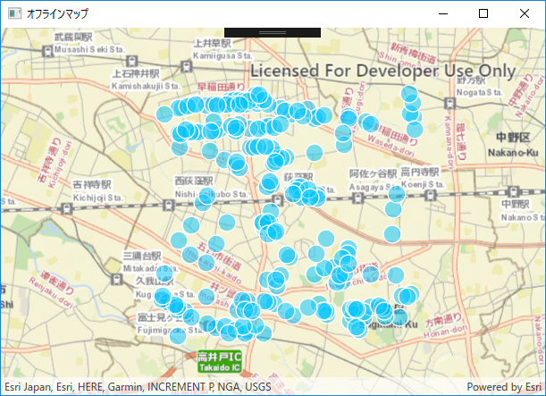
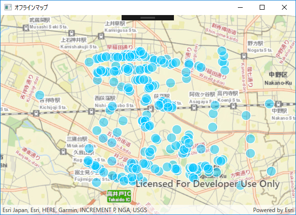

# オフラインアプリ開発手順書

## 概要

これは、ArcGIS Runtime SDK と Esri のクラウドサービス　[ArcGIS Online](http://www.arcgis.com/features/index.html) を使用してオフラインアプリを作るハンズオンです。
ArcGIS　Runtime SDK には　[iOS](https://developers.arcgis.com/ios/latest/) / [Android](https://developers.arcgis.com/android/latest/) / [.NET](https://developers.arcgis.com/net/latest/) の開発環境があります。今回のハンズオンでは [ArcGIS Runtime SDK for .NET](https://developers.arcgis.com/net/latest/) を利用します。

ハンズオンで使用するデータは こちらの[フィーチャ レイヤー](https://services.arcgis.com/wlVTGRSYTzAbjjiC/arcgis/rest/services/SampleDataHandsOn/FeatureServer/)を使用します。


[ArcGIS Online 上で表示](http://www.arcgis.com/home/webmap/viewer.html?webmap=4e90d664e499454a831ec05250299522)

## 今回 作るものは？
通信が制限されている状況で地図上にプロットしてポイントデータを作成し、作成したポイントデータをオンライン環境時に　ArcGIS Online のフィーチャ レイヤーと同期するオフラインアプリを作成します。


## 開発環境 (Windows)
|サポート OS|最大バージョン|
|----|----|
|Windows 10||
|Windows 8.1||
|Windows 7| SP1|
|Windows 10||

### サポート開発環境
- Visual Studio 2017
- Visual Studio 2015 Update 3
- Visual Studio Express 2015 for Windows Desktop Update 3
- Visual Studio 2013 Update 5
- Visual Studio Express 2013 for Windows Desktop Update 5
- Visual Studio 2012 Update 4
- Visual Studio Express 2012 for Windows Desktop Update 4

### SDK の要件
Microsoft .NET Framework 4.5.2（最小バージョン）

詳細については[システム要件](https://developers.arcgis.com/net/latest/forms/guide/system-requirements.htm)を参照してください。

## 手を動かそう

それではここから実際に手を動かしながらやっていきましょう。

### 手順 1: プロジェクトの作成
 
### 手順 2: ArcGIS Runtime SDK NuGet パッケージのインストール
 


### 手順 3: Runtime コンテンツの作成して表示

オフライン環境においてデータの参照や書き込みを行うために Runtime コンテンツ（*.geodatabase）を作成します。
そして作成した Runtime コンテンツ（*.geodatabase）を参照して地図に表示します。

地図を表示する部分 ユーザーインタフェースとして、**sample/MainWindow.xaml** に UI を作成していきます。
地図表示（ユーザインタフェース）は **XAML**(ざむる)という、マークアップ言語で書いていきます。(Extensible Application Markup Language)

### MainWindow.xaml

まず、MapView コントロールをページに追加するには、XAML 名前空間を割り当てる必要があります。
次のように XML 名前空間の参照を WindowContentPage の XAML 要素に追加します。

```xml
  xmlns:esri="http://schemas.esri.com/arcgis/runtime/2013"
```
ArcGIS Runtime API のすべてのXAML要素は、http://schemas.esri.com/arcgis/runtime/2013 名前空間で使用できます。

次に、Grid の中に MapView クラスを追加します：

```xml
  <Grid>
     <esri:MapView x:Name="MyMapView"/>
  </Grid>
```
【確認】現在、`MainWindow.xaml`は、次のようになっているはずです。

```xml
<Window x:Class="sample.MainWindow"
        xmlns="http://schemas.microsoft.com/winfx/2006/xaml/presentation"
        xmlns:x="http://schemas.microsoft.com/winfx/2006/xaml"
        xmlns:d="http://schemas.microsoft.com/expression/blend/2008"
        xmlns:mc="http://schemas.openxmlformats.org/markup-compatibility/2006"
        xmlns:esri="http://schemas.esri.com/arcgis/runtime/2013"
        xmlns:local="clr-namespace:sample"
        mc:Ignorable="d"
        Title="オフラインマップ" Height="450" Width="625">
 
 <Grid>
    <esri:MapView x:Name="MyMapView"/>
 </Grid>

</ContentPage>
```

### MainWindow.xaml.cs

次に背景地図を表示する部分を作成します。

1. プロジェクトの `sample/MainWindow..xaml.cs` ファイルを開きます。
2. 以下のような内容で背景地図を呼び出す部分を書いていきます。

```csharp
using System;
using System.Linq;
using System.Windows;
using System.Collections.Generic;

using Esri.ArcGISRuntime;
using Esri.ArcGISRuntime.Mapping;
using Esri.ArcGISRuntime.Geometry;
using Esri.ArcGISRuntime.Data;
using Esri.ArcGISRuntime.UI.Controls;
using Esri.ArcGISRuntime.Tasks;
using Esri.ArcGISRuntime.Tasks.Offline;

namespace sample
{
    /// <summary>
    /// MainWindow.xaml の相互作用ロジック
    /// </summary>
    public partial class MainWindow : Window
    {
        // ArcGIS Online フィーチャ レイヤーサービスの URL  
        private const string FEATURELAYER_SERVICE_URL = "https://services7.arcgis.com/903opF9LxIC4unCH/arcgis/rest/services/yokohamaTripPoint/FeatureServer/";

        private Map myMap;

        private SyncGeodatabaseParameters syncParams;
        
        public MainWindow()
        {
            InitializeComponent();
            Initialize();
        }

        public void Initialize()
        {
            myMap = new Map(BasemapType.Streets, 35.704085, 139.619373, 13);
            MyMapView.Map = myMap;
        }
    }
}
```
#### アプリの実行

ここでアプリを実行します。
実行後の以下のような画面になります。


### 手順 4: Runtime コンテンツを作成して表示する

オフライン環境においてデータの参照や書き込みを行うために Runtime コンテンツ（*.geodatabase）を作成します。作成した Runtime コンテンツ（*.geodatabase）を参照して地図に表示します。

ここでは Runtime コンテンツ（*.geodatabase）を新規に作成し、作成した Runtime コンテンツ（*.geodatabase）を地図に表示する部分を書いていきます。<br/>
また、Runtime コンテンツ（*.geodatabase）が存在している場合は 既存の Runtime コンテンツ（*.geodatabase）を読み込むようにします。

### MainWindow.xaml

1. プロジェクトの `sample/MainWindow..xaml.cs` ファイルを開きます。
2. `Initialize` 関数に `getGeodatabasePath()`、`chkGeodatabase()` 関数を作成します。

```csharp
public void Initialize()
{
    myMap = new Map(BasemapType.Streets, 35.704085, 139.619373, 13);

    MyMapView.Map = myMap;

    // PC内の geodatabase ファイル作成パスを取得する
    getGeodatabasePath();

    // すでにランタイムコンテンツが作成されているかチェックする
    chkGeodatabase();
}
```

3. getGeodatabasePath()`、`chkGeodatabase()` 関数をそれぞれ作成します。

```csharp
////////////////////////////////////////////////////////////////////////////////////////
// 端末ローカルのパスまわり
////////////////////////////////////////////////////////////////////////////////////////
/**
* geodatabaseファイル作成のパスを取得する
**/
private String mGeodatabasePath;
private void getGeodatabasePath()
{
    // カレントディレクトリの取得
    string stCurrentDir = System.Environment.CurrentDirectory;

    // カレントディレクトリを表示する
    //MessageBox.Show(stCurrentDir);

    mGeodatabasePath = stCurrentDir + "\\" + "orglayer.geodatabase";
}

/**
* ローカルファイルをMapViewへ追加する
* */
private void chkGeodatabase()
{
    // カレントディレクトリの取得
    string stCurrentDir = System.Environment.CurrentDirectory;

    mGeodatabasePath = stCurrentDir + "\\" + "orglayer.geodatabase";

    if (System.IO.File.Exists(mGeodatabasePath))
    {
        // 存在する場合は、既存のgeodatabaseから読み込む
        readGeoDatabase();
    }
    else
    {
        // ファイル作成メソッドをcallする
        createGeodatabaseSyncTask();
    }
}
```

4. 既存 GeoDatabase から読み込む、`readGeoDatabase()`関数を作成します。

```csharp
/**
 * 既存 GeoDatabase から読み込む
 ****/
private GeodatabaseFeatureTable mGdbFeatureTable;
private FeatureLayer mFeatureLayer;
private Geodatabase geodatabase;
private async void readGeoDatabase()
{
    geodatabase = await Geodatabase.OpenAsync(mGeodatabasePath);

    if (geodatabase.GeodatabaseFeatureTables.Count > 0)
    {
        // データベース内の最初のテーブルを取得する
        mGdbFeatureTable = geodatabase.GeodatabaseFeatureTables.FirstOrDefault();

        await mGdbFeatureTable.LoadAsync();

        if (mGdbFeatureTable.LoadStatus == LoadStatus.Loaded)
        {
            mFeatureLayer = new FeatureLayer(mGdbFeatureTable);

            myMap.OperationalLayers.Add(mFeatureLayer);
        }
    }
}
```

5. ローカルフォルダに Runtime コンテンツ（*.geodatabase）を作成します。

 Runtime コンテンツ（*.geodatabase）の作成は、ステップ①、②、③ の手順で行っていきます。

- ① 同期させたいArcGIS Online の Feature Layer でタスクを作成する。
- ② 同期させたいArcGIS Online の Feature Layer のパラメータを取得する。
- ③ 同期させたいArcGIS Online の Feature Layer でローカル geodatabase を作成する。

 コードの TODO 箇所に処理を書いていきましょう。<br/>
 詳細は、 [Runtime コンテンツ（*.geodatabase）の作成](https://developers.arcgis.com/net/latest/wpf/guide/create-an-offline-layer.htm)を参考にしてください。
 
```csharp
////////////////////////////////////////////////////////////////
// ローカルフォルダにランタイムコンテンツ(*.geodatabase)作成
// 【概要】
//　① 同期させたいArcGIS Online の Feature Layer でタスクを作成する
//　② 同期させたいArcGIS Online の Feature Layer のパラメータを取得する
//　③ 同期させたいArcGIS Online の Feature Layer でローカル geodatabase を作成する
////////////////////////////////////////////////////////////////

private GeodatabaseSyncTask geodatabaseSyncTask;
private GenerateGeodatabaseParameters generateParams;
private GenerateGeodatabaseJob generateJob;
/**
 * GeoDatabaseを新規に作成する
 * ① 同期させたいArcGIS Online の Feature Layer でタスクを作成する
 ****/
private async void createGeodatabaseSyncTask()
{
    // TODO 同期させたいレイヤーで geodatabase 作成 タスクオブジェクトを作成する
            
    // ② 同期させたいArcGIS Online の Feature Layer のパラメータを取得する
    generateGeodatabaseParameters();
}

/**
 * GeoDatabaseを新規に作成する
 * ② 同期させたいArcGIS Online の Feature Layer のパラメータを取得する
 **/
private async void generateGeodatabaseParameters()
{
    // TODO geodatabase 作成のためのパラメータを取得する

    // TODO レイヤーごとに同期を設定する 

    // TODO 添付ファイルは返さない

    // ③ 同期させたいArcGIS Online の Feature Layer でローカル geodatabase を作成する
    generateGeodatabase();
}

/**
 * GeoDatabaseを新規に作成する
 * ③ 同期させたいArcGIS Online の Feature Layer でローカル geodatabase を作成する
 **/
private void generateGeodatabase()
{
    // TODO geodatabaseファイル作成ジョブオブヘジェクトを作成する

    // TODO JobChanged イベントを処理してジョブのステータスをチェックする

    // ジョブを開始し、ジョブIDをコンソール上に表示
    generateJob.Start();
    Console.WriteLine("Submitted job #" + generateJob.ServerJobId + " to create local geodatabase");
}

// JobChangedイベントのハンドラ
private void OnGenerateJobChanged(object sender, EventArgs e)
{
    // get the GenerateGeodatabaseJob that raised the event
    var job = sender as GenerateGeodatabaseJob;
    
    // report error (if any)
    if (job.Error != null)
    {
        Console.WriteLine("Error creating geodatabase: " + job.Error.Message);
        return;
    }

    // check the job status
    if (job.Status == JobStatus.Succeeded)
    {
        // ジョブが成功した場合はローカルデータをマップに追加する
        readGeoDatabase();
    }
    else if (job.Status == JobStatus.Failed)
    {
        // report failure
        Console.WriteLine("Unable to create local geodatabase.");
    }
    else
    {
        // job is still running, report last message
        Console.WriteLine(job.Messages[job.Messages.Count - 1].Message);
    }
}
```

【確認】現在`createGeodatabaseSyncTask()`、`generateGeodatabaseParameters()`、`generateGeodatabase()`関数は、次のようになっているはずです。

```csharp
/**
 * GeoDatabaseを新規に作成する
 * ① 同期させたいArcGIS Online の Feature Layer でタスクを作成する
 ****/
private async void createGeodatabaseSyncTask()
{
    // TODO 同期させたいレイヤーで geodatabase 作成 タスクオブジェクトを作成する
    var featureServiceUri = new Uri(FEATURELAYER_SERVICE_URL);
    geodatabaseSyncTask = await GeodatabaseSyncTask.CreateAsync(featureServiceUri);
            
    // ② 同期させたいArcGIS Online の Feature Layer のパラメータを取得する
    generateGeodatabaseParameters();
}

/**
 * GeoDatabaseを新規に作成する
 * ② 同期させたいArcGIS Online の Feature Layer のパラメータを取得する
 **/
private async void generateGeodatabaseParameters()
{
    // TODO geodatabase 作成のためのパラメータを取得する
    Envelope extent = MyMapView.GetCurrentViewpoint(ViewpointType.BoundingGeometry).TargetGeometry as Envelope;
    generateParams = await geodatabaseSyncTask.CreateDefaultGenerateGeodatabaseParametersAsync(extent);

    // TODO レイヤーごとに同期を設定する 
    generateParams.SyncModel = SyncModel.Layer;

    // TODO 添付ファイルは返さない
    generateParams.ReturnAttachments = false;

    // ③ 同期させたいArcGIS Online の Feature Layer でローカル geodatabase を作成する
    generateGeodatabase();
}

/**
 * GeoDatabaseを新規に作成する
 * ③ 同期させたいArcGIS Online の Feature Layer でローカル geodatabase を作成する
 **/
private void generateGeodatabase()
{
    // TODO geodatabaseファイル作成ジョブオブヘジェクトを作成する
    generateJob = geodatabaseSyncTask.GenerateGeodatabase(generateParams, mGeodatabasePath);

    // TODO JobChanged イベントを処理してジョブのステータスをチェックする
    generateJob.JobChanged += OnGenerateJobChanged;

    // ジョブを開始し、ジョブIDをコンソール上に表示
    generateJob.Start();
    Console.WriteLine("Submitted job #" + generateJob.ServerJobId + " to create local geodatabase");
}
```

#### アプリの実行

ここでアプリを実行します。
実行後の以下のような画面になります。



### 手順 5: 新しいポイントを追加する

新しいポイントを Runtime コンテンツ（*.geodatabase）に追加する処理を書いていきましょう。

### MainWindow.xaml

1. プロジェクトの `sample/MainWindow..xaml.cs` ファイルを開きます。
2. `Initialize` 関数に `MyMapView.GeoViewTapped += OnMapViewTapped;` 追加します。これは地図をタップしたときのイベントを実行するための処理になります。

```csharp
public void Initialize()
{
    myMap = new Map(BasemapType.Streets, 35.704085, 139.619373, 13);

    MyMapView.Map = myMap;

    MyMapView.GeoViewTapped += OnMapViewTapped;

    // PC内の geodatabase ファイル作成パスを取得する
    getGeodatabasePath();

    // すでにランタイムコンテンツが作成されているかチェックする
    chkGeodatabase();

}
```

3. 地図をタップしたイベントの処理を作成していきます。地図をタップした箇所にポイントデータを作成して、作成したポイントデータは ローカル geodatabase に追加していきます。

```csharp
private void OnMapViewTapped(object sender, GeoViewInputEventArgs e)
{
    try
    {
        // get the click point in geographic coordinates
        var mapClickPoint = e.Location;
        addPoint(mapClickPoint);
    }
    catch (Exception ex)
    {
        MessageBox.Show("Sample error", ex.ToString());
    }
}

////////////////////////////////////////////////////////////////
// 追加
////////////////////////////////////////////////////////////////
/**
 * 新しいポイントを追加する
 * From touch eventから
 **/
private void addPoint(MapPoint structureLocation)
{
    MapPoint wgs84Point = (MapPoint)GeometryEngine.Project(structureLocation, SpatialReferences.Wgs84);
    addFeature(wgs84Point);
}

/**
 * ローカルgeodatabaseにポイントを追加する
 **/
private async void addFeature(MapPoint pPoint)
{
    if (!mGdbFeatureTable.CanAdd())
    {
        // Deal with indicated error
        return;
    }

    // 項目にデータを入れる
    var attributes = new Dictionary<string, object>();
    attributes.Add("BuildingName ", "ESRIジャパンnow！");

    Feature addedFeature = mGdbFeatureTable.CreateFeature(attributes, pPoint);

    await mGdbFeatureTable.AddFeatureAsync(addedFeature);

    FeatureQueryResult results = await mGdbFeatureTable.GetAddedFeaturesAsync();

    foreach (var r in results)
    {
        Console.WriteLine("add point geodatabase : '" + r.Attributes["BuildingName "]);
    }
}
```

#### アプリの実行

ここでアプリを実行します。
実行後の以下のような画面になり、地図をタップすることでポイントが追加されます。




### 4. 動作確認

それでは、アプリを起動してみましょう。  
アプリを開くと、Web マップが読み込まれ、表示されます。  
マップをクリックするとクリック地点から最寄りの避難場所へのルートが表示されます。


