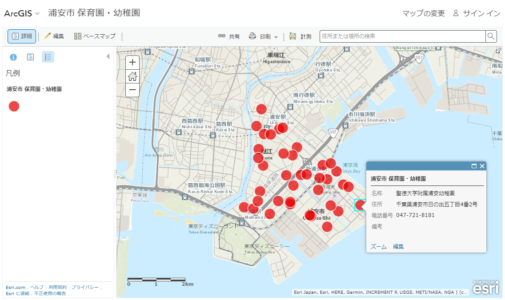
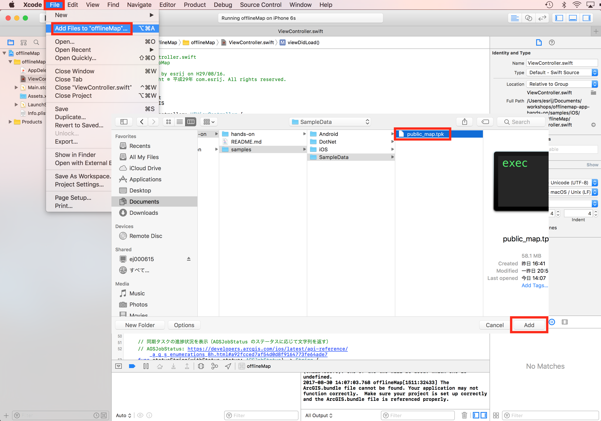
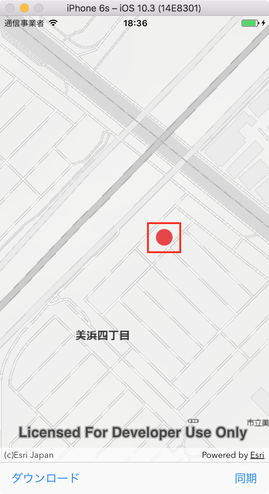

# オフライン アプリ開発ハンズオン

[ArcGIS Runtime SDK for iOS](https://developers.arcgis.com/ios/latest/) を使用してオフライン アプリを作成するハンズオンです。

## 実装する機能
- タイル パッケージ（背景地図）の表示
- フィーチャ サービス（主題図）の表示
- フィーチャ サービスのデータのダウンロード
- フィーチャの編集（ポイント追加）
- 編集結果をフィーチャ サービスと同期

## 開発環境
使用する環境が動作要件を満たしているか[こちら](https://www.esrij.com/products/arcgis-runtime-sdk-for-ios/environments/)のページからご確認ください。

## 使用するデータ
- 背景地図：[タイル パッケージ](https://desktop.arcgis.com/ja/arcmap/latest/map/working-with-arcmap/about-tile-packages.htm)（ArcGIS Desktop で作成）
 * ESRIジャパン データコンテンツのスターターパックに含まれる[公共地図](https://www.esrij.com/products/data-content-starter/details/kokyo/)を使用
- 主題図：[フィーチャ サービス](http://doc.arcgis.com/ja/arcgis-online/share-maps/publish-features.htm)（ArcGIS Online で配信）
 * デモ用の保育園・幼稚園データ（浦安市の保育園・幼稚園のオープンデータをもとに作成）
 * フィーチャ サービスの URL（Rest エンドポイント）: https://services.arcgis.com/wlVTGRSYTzAbjjiC/ArcGIS/rest/services/urayasushi_hoikuen_yochien/FeatureServer
 * ArcGIS .com マップ ビューアーで[データを確認してみる](https://www.arcgis.com/home/webmap/viewer.html?webmap=49aaf6580c9142e28d8912cee6f573c9)



## 手順 1: SDK のインストール/プロジェクトのダウンロード
### SDK のインストール
1. SDK の[ダウンロードページ](https://developers.arcgis.com/downloads)にアクセスします（事前に作成した開発者アカウントでサインインします。開発者アカウントをこれから作成する場合は、[こちら](http://esrijapan.github.io/arcgis-dev-resources/get-dev-account/)を参考にして作成してください）。
1. ArcGIS Runtime SDK for iOS の箇所の [Download] をクリックして、インストーラーをダウンロードします。

1. ダウンロードしたインストーラー（.pkg ファイル）を実行して SDK をインストールします。

### サンプル プロジェクトのダウンロード
1. [workshops](https://github.com/EsriJapan/workshops) ページを開いて [Clone or download] -> [Download ZIP] をクリックして、ファイル一式をダウンロードします。

  
1. サンプル プロジェクト（workshops/offlinemap-app-hands-on/samples/iOS/sample/offlineMap.xcodeproj）を Xcode で開きます。

#### Tips:
* SDK は [CocoaPods を使用してインストール](http://esrijapan.github.io/arcgis-dev-resources/ios/install-ios-100.x/#cocoapods-を使用して-sdk-をインストールする)することも可能です。
* サンプル プロジェクトには事前に必要な Xcode プロジェクトの設定、地図画面（UIView を継承した AGSMapView クラス）やボタン等を作成しています。アプリ開発時に必要な設定は[インストール ガイド](http://esrijapan.github.io/arcgis-dev-resources/ios/install-ios-100.x/)をご覧ください。
* 今回のハンズオンで作成するサンプルの完成版が[こちら](http://esrijapan.github.io/workshops/offlinemap-app-hands-on/samples/iOS/sample/complete-version)にありますので、作業に困ったら参考にしてください。

## 手順 2: タイル パッケージ（背景地図）の表示
サンプル プロジェクトには事前に地図画面を作成してあるので、そこに背景地図を表示していきます。ハンズオンで使用するタイル パッケージ（背景地図）は、GitHub からダウンロードしたフォルダ（workshops/offlinemap-app-hands-on/samples/SampleData/public_map.tpk）にあります。


1. Xcode のメニューで、[File] -> [Add Files to "offlineMap"...] から、public_map.tpk ファイルをプロジェクトに追加します。

 

1. viewDidLoad メソッドにタイル パッケージ（背景地図）を表示するコードを記述します。AGSTileCache のパラメーターにはタイル パッケージ ファイルのファイル名（.tpk のファイル名）を指定します。
```javascript
// 背景用のタイル レイヤー（タイル パッケージ）を表示
// AGSTileCache のパラメーターには .tpk ファイルの名前を指定
let localTiledLayer = AGSArcGISTiledLayer(tileCache: AGSTileCache(name: "public_map"))
// タイル レイヤーを背景としてマップを作成
let map = AGSMap(basemap: AGSBasemap(baseLayer: localTiledLayer))
// マップビュー（地図画面）にマップを表示
self.mapView.map = map
```
1. サンプル プロジェクトを実機もしくはシミュレーターで実行すると、以下のように地図が表示されます。

 

## 手順 3: フィーチャ サービス（主題図）の表示

1. フィーチャ レイヤーを作成しフィーチャ サービス（主題図）をマップに追加します。
```javascript
// 主題図用のフィーチャ レイヤー（フィーチャ サービス）の表示
// フィーチャ サービスの URL を指定してフィーチャ テーブル（AGSServiceFeatureTable）を作成する
// フィーチャ サービスの URL はレイヤー番号（〜/FeatureServer/0）まで含める
let featureTable = AGSServiceFeatureTable(url: URL(string: FEATURE_SERVICE_URL + "/0")!)
// フィーチャ テーブルからフィーチャ レイヤーを作成
let featureLayer = AGSFeatureLayer(featureTable: featureTable)
// マップにフィーチャ レイヤーを追加
self.mapView.map?.operationalLayers.add(featureLayer)
```
1. フィーチャ レイヤーの読み込み完了後に、フィーチャ サービスの全体表示範囲にズームし、ダウンロード ボタンを有効化します。
```javascript
// フィーチャ レイヤーの読み込み完了時の処理
featureLayer.load(completion: { (error) in
    if error == nil {
        // フィーチャ レイヤーの全体表示領域にマップをズーム
        // 全体表示領域は Rest エンドポイント（Full Extent:）で確認可能
        // https://services.arcgis.com/wlVTGRSYTzAbjjiC/ArcGIS/rest/services/urayasushi_hoikuen_yochien/FeatureServer
        let viewPoint = AGSViewpoint(targetExtent: featureLayer.fullExtent!)
        self.mapView.setViewpoint(viewPoint)

        // ダウンロード ボタンのタップを有効化
        self.downloadBtn.isEnabled = true
    }
})
```
1. プロジェクトを実行して、フィーチャ サービスのデータが表示されるか確認します。


## 手順 4: フィーチャ サービスのデータのダウンロード
1. viewDidLoad メソッドでフィーチャ サービスの同期タスク（AGSGeodatabaseSyncTask）を作成します。
```javascript
// フィーチャ サービス URL を使用して同期タスク（AGSGeodatabaseSyncTask）を作成
self.syncTask = AGSGeodatabaseSyncTask(url: URL(string: FEATURE_SERVICE_URL)!)
```

1. ダウンロード ボタンのイベント メッソドで同期タスクのパラメーターを設定します。

 ```javascript
// 同期タスクのダウンロード パラメーターを作成
let params = AGSGenerateGeodatabaseParameters()
// ダウンロードするレイヤー番号の指定（最上位のレイヤー）
let layerOption = AGSGenerateLayerOption(layerID: 0)
params.layerOptions = [layerOption]
// ダウンロードする範囲の指定（マップの現在の表示範囲）
params.extent = self.mapView.visibleArea
// ダウンロードするファイル（.geodatabase）のファイル名を指定（任意の名前）
// タイムスタンプを使用して現在時刻のユニークなファイル名を設定する
let dateFormatter = DateFormatter()
dateFormatter.dateFormat = "yyyy-MM-dd'T'HH:mm:ssZ"
let path = NSSearchPathForDirectoriesInDomains(.documentDirectory, .userDomainMask, true)[0]
let fullPath = "\(path)/\(dateFormatter.string(from: Date())).geodatabase"
```

1. パラメーターを設定して同期タスクの AGSGenerateGeodatabaseJob（.geodatabase のダウンロード）を実行します。
```javascript
// ダウンロード（AGSGenerateGeodatabaseJob）を実行
generateJob =  self.syncTask.generateJob(with: params, downloadFileURL: URL(string: fullPath)!)
self.generateJob.start(statusHandler: { (status: AGSJobStatus) -> Void in
    // 同期タスクの進捗状況を表示
    print(self.statusString(withStatus: status))
}) { [weak self] (object: AnyObject?, error: Error?) -> Void in
    if let error = error {
        // ダウンロードのエラー時にエラー メッセージを表示
        print(error.localizedDescription)
    }
    else {
        // ダウンロードの成功時の処理を実装
    }
}
```

1. ダウンロードに成功した際の処理を記述します。ダウンロードされたた .geodatabase ファイルからフィーチャ レイヤーを作成しマップに追加します。
```javascript
// ダウンロードの成功時の処理を実装
// ダウンロードされたファイル（.geodatabase）を取得
self?.generatedGeodatabase = object as! AGSGeodatabase
// .geodatabase を読み込む
self?.generatedGeodatabase.load(completion: { [weak self] (error:Error?) -> Void in
    if let error = error {

        // 読み込みのエラー時にエラー メッセージを表示
        print(error.localizedDescription)

    }
    else {

        // 読み込みの成功時の処理を実装
        // マップ上に現在表示しているフィーチャ レイヤーを削除
        self?.mapView.map?.operationalLayers.removeAllObjects()
        // ダウンロードした .geodatabase をマップ上に表示
        // .geodatabase からフィーチャ テーブル（AGSGeodatabaseFeatureTable）を作成
        self?.geodatabaseFeatureTable = self?.generatedGeodatabase.geodatabaseFeatureTables[0]
        // フィーチャ テーブルからフィーチャ レイヤーを作成
        let featureLayer = AGSFeatureLayer(featureTable: (self?.geodatabaseFeatureTable)!)
        // フィーチャ レイヤーをマップに追加
        self?.mapView.map?.operationalLayers.add(featureLayer)

        // 同期ボタンのタップを有効化
        self?.syncBtn.isEnabled = true

    }
})
```
1. プロジェクトを実行し、ダウンロード ボタンをタップしてフィーチャ サービスのデータをダウンロードしてみましょう。Xcode のコンソールにダウンロードの進捗状況が表示されます。Succeeded と表示されたらダウンロードの完了です。


## 手順 5: フィーチャの編集（ポイント追加）

1. マップがタップされたイベントをハンドリングするために、デリゲート プロトコル(AGSGeoViewTouchDelegate) を宣言します。
```javascript
class ViewController: UIViewController, AGSGeoViewTouchDelegate {
```
1. viewDidLoad メソッドでマップのタッチ操作のデリゲートを設定します。
```javascript
// マップのタッチ操作のデリゲートを設定
self.mapView.touchDelegate = self
```

1. マップがタップされた時に実行されるデリゲート メソッドを記述します。
```javascript
//MARK: - AGSGeoViewTouchDelegate（マップ上をタップ）
func geoView(_ geoView: AGSGeoView, didTapAtScreenPoint screenPoint: CGPoint, mapPoint: AGSPoint) {
    // ダウンロードしたデータを表示している時だけ実行
    if self.geodatabaseFeatureTable != nil {

        // フィーチャ テーブルのスキーマを使用して空のフィーチャ（ポイント）を作成
        let feature = self.geodatabaseFeatureTable.createFeature()
        // 作成したフィーチャのジオメトリをマップ上をタップした位置に指定
        feature.geometry = mapPoint

        // フィーチャの属性情報を編集（name フィールド（String型）に文字列を指定）
        feature.attributes["name"] = "何か値を入力"
        // フィーチャ テーブルにフィーチャを追加
        self.geodatabaseFeatureTable.add(feature) { (error: Error?) -> Void in
            if let error = error {
                // フィーチャ追加のエラー時にエラー メッセージを表示
                print(error.localizedDescription)
            }
            else {

                // フィーチャ追加の成功
                print("Successful edit")

            }
        }

    }
}
```
1. プロジェクトを実行します。ダウンロード ボタンをタップしてフィーチャ サービスのデータをダウンロードした後に、マップ上をタップしてポイントを追加してみましょう。マップ上をタップするとタップした場所に、水色のシンボルのポイントが表示されます。


## 手順 6: 編集結果をフィーチャ サービスと同期
1. 同期ボタンのイベント メッソドで同期タスクのパラメーターを設定します。
```javascript
// 同期タスクの同期 パラメーターを作成
let params = AGSSyncGeodatabaseParameters()
// ダウンロードするレイヤー番号の指定（最上位のレイヤー）
let layerOption = AGSSyncLayerOption(layerID: 0)
params.layerOptions = [layerOption]
// 同期方向の指定（端末で変更されたデータをフィーチャ サービスに更新）
params.geodatabaseSyncDirection = .upload
```
1. パラメーターを設定して同期タスクの AGSSyncGeodatabaseJob（.geodatabase とフィーチャ サービスの同期）を実行します。
```javascript
// 同期（AGSSyncGeodatabaseJob）を実行
self.syncJob = self.syncTask.syncJob(with: params, geodatabase: self.generatedGeodatabase)
self.syncJob.start(statusHandler: { (status: AGSJobStatus) -> Void in
    // 同期タスクの進捗状況を表示
    print(self.statusString(withStatus: status))  
}, completion: { (results: [AGSSyncLayerResult]?, error: Error?) -> Void in
    if let error = error {        
        // 同期のエラー時にエラー メッセージを表示
        print(error.localizedDescription)
    }
    else {
        // 同期に成功
        print("Successful sync")
    }
})
```
1. プロジェクトを実行します。ダウンロード ボタンをタップしてフィーチャ サービスのデータをダウンロードした後に、端末をオフライン状態にしてみましょう。ポイントを追加しても[元のフィーチャ サービス](https://www.arcgis.com/home/webmap/viewer.html?webmap=4e90d664e499454a831ec05250299522)には反映されていないことが分かります。端末をオンライン状態に戻し、同期ボタンをタップしてフィーチャ サービスにポイントが追加されているか確認してみてください。


ハンズオンは以上で終了です。時間に余裕があるようでしたら、次のステップアップの手順を試してみてください。

## ステップアップ: ポップアップを使用した編集
フィーチャの編集（ジオメトリ、属性、アタッチメントの更新）はコードで実装する以外にも、ポップアップ コントローラーを使用して実装することもできます。フィーチャの編集に必要な一連の操作と UI がコントローラー上で提供されるため、簡単にアプリに編集機能を実装できます。
1. ポップアップを使用するのに必要なデリゲート プロトコル(AGSPopupsViewControllerDelegate) と AGSPopupsViewController を宣言します。
```javascript
class ViewController: UIViewController, AGSGeoViewTouchDelegate, AGSPopupsViewControllerDelegate {

  private var popupsVC:AGSPopupsViewController!
```
1. マップがタップされた時に実行されるデリゲート メソッドを以下のように変更します。
```javascript
//MARK: - AGSGeoViewTouchDelegate（マップ上をタップ）
func geoView(_ geoView: AGSGeoView, didTapAtScreenPoint screenPoint: CGPoint, mapPoint: AGSPoint) {
    // ダウンロードしたデータを表示している時だけ実行
    if self.geodatabaseFeatureTable != nil {

        // フィーチャ テーブルのスキーマを使用して空のフィーチャ（ポイント）を作成
        let feature = self.geodatabaseFeatureTable.createFeature()
        // 作成したフィーチャのジオメトリをマップ上をタップした位置に指定
        feature.geometry = mapPoint

        // ポップアップ（フィーチャの編集画面）を作成
        let popup = AGSPopup(geoElement: feature)

        // ポップアップの画面をカスタマイズ
        // フィーチャの削除を不可に設定
        popup.popupDefinition.allowDelete = false
        // フィーチャのジオメトリの編集を不可に設定
        popup.popupDefinition.allowEditGeometry = false
        // フィーチャのアタッチメント（添付ファイル）の編集を不可に設定
        popup.popupDefinition.showAttachments = false

        // ポップアップを使用してポップアップ ビュー コントローラーを作成
        self.popupsVC = AGSPopupsViewController(popups: [popup], containerStyle: .navigationBar)
        // ポップアップの操作のデリゲートを設定
        self.popupsVC.delegate = self
        // ポップアップ ビュー コントローラーを表示
        self.present(self.popupsVC, animated: true, completion: nil)

    }
}
```
1. ポップアップの操作が終了した時に実行されるデリゲート メソッドを以下のように記述します。
```javascript
//MARK: - AGSPopupsViewControllerDelegate（ポップアップ操作の終了）
// ポップアップを使用して属性を編集する場合
func popupsViewControllerDidFinishViewingPopups(_ popupsViewController: AGSPopupsViewController) {
    // ポップアップ ビュー コントローラーを非表示にする
    self.dismiss(animated: true, completion:nil)
    self.popupsVC = nil
}
```
1. ポップアップ画面の表示に使用する ArcGIS リソース バンドル ファイルをプロジェクトに追加します。[こちら](http://esrijapan.github.io/arcgis-dev-resources/ios/install-ios-100.x/#arcgis-リソース-バンドルの追加)の手順を参考にしてください。
1. プロジェクトを実行します。フィーチャ サービスのデータをダウンロードした後に、マップ上をタップするとポップアップが表示され、属性情報を入力できます。

